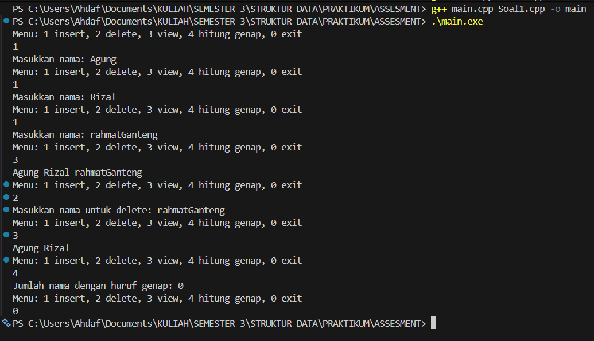

# Assesment - Struktur Data

Identitas Pengumpul

Nama: Rahmat Ahdaf Albariza

NIM: 103112430003

Kelas: IF-12-05 - Struktur Data - Ruang LAB-MM

1. Kode Program

Berikut adalah kode program untuk implementasi Singly Linked List

Soal1.h
```cpp
// Soal nomor 1
#ifndef SLL_H
#define SLL_H
#include <string> // Menyertakan library string
using namespace std;

// Definisi struktur Node dan SLL
struct Node{
    string namaMahasiswa;
    Node* next;
};

struct SLL {
    Node* head;
};

void createList(SLL &L); // Inisialisasi List
bool isEmpty(SLL L); // Cek apakah List kosong

void insertFirst(SLL &L, string x); // Menambahkan node di awal
void insertLast(SLL &L, string x); // Menambahkan node di akhir
void insertAfter(Node* prevNode, string x);// Menambahkan node setelah prevNode

void deleteFirst(SLL &L); // Menghapus node pertama
void deleteLast(SLL &L); // Mengahapus node terakhir
void deleteAfter(Node* prevNode); // Menghapus node setelah prevNode

void viewList(SLL L); // Menampilkan isi List
int countEven(SLL L); // Menghitung jumlah nama dengan huruf genap

#endif
```

Soal1.cpp
```cpp
// Soal nomor 1

#include "Soal1.h"
#include <iostream>
using namespace std;

// Inisialisasi List
void createList(SLL &L){
    L.head = nullptr;
}

// Cek apakah List kosong
bool isEmpty(SLL L){
    return L.head == nullptr;
}

// Menambahkan node di awal
void insertFirst(SLL &L, string x){
    Node* n = new Node{x, L.head};
    L.head = n;
}

// Menambahkan node di akhir
void insertLast(SLL &L, string x){
    Node* n = new Node{x, nullptr};
    if(isEmpty(L)){
        L.head = n;
    } else {
        Node* p = L.head;
        while(p->next) p = p->next;
        p->next = n;
    }
}

// Menambahkan node setelah prevNode
void insertAfter(Node* prevNode, string x){
    if(prevNode){
        Node* n = new Node{x, prevNode->next};
        prevNode->next = n;
    }
}

// Menghapus node pertama
void deleteFirst(SLL &L){
    if(!isEmpty(L)){
        Node* p = L.head;
        L.head = p->next;
        delete p;
    }
}

// Mengahapus node terakhir
void deleteLast(SLL &L){
    if(isEmpty(L)) return;
    if(L.head->next == nullptr){
        delete L.head;
        L.head = nullptr;
        return;
    }
    Node* p = L.head;
    Node* prev = nullptr;
    while (p->next){ prev = p; p = p->next; }
    prev->next = nullptr;
    delete p;
}

// Menghapus node setelah prevNode
void deleteAfter(Node* prevNode){
    if(prevNode && prevNode->next){
        Node* p = prevNode->next;
        prevNode->next = p->next;
        delete p;
    }
}

// Menampilkan isi List
void viewList(SLL L){
    Node* p = L.head;
    while(p){ cout << p->namaMahasiswa << " "; p = p->next; }
    cout << " " << endl;
}


// Menghitung jumlah nama dengan huruf genap
int countEven(SLL L){
    int c = 0;
    Node* p = L.head;
    while(p){ if(p->namaMahasiswa.length() % 2 == 0) c++; p = p->next; }
    return c;
}

```

main.cpp
```cpp
// Soal nomor 1

#include <iostream>
#include <string>
#include "Soal1.h"
using namespace std;

int main() {
    SLL L;
    createList(L);

    int menu = -1;
    string namaMahasiswa;

    // program menu
    while (menu != 0) {
        cout << "Menu: 1 insert, 2 delete, 3 view, 4 hitung genap, 0 exit\n";
        cin >> menu;
        cin.ignore();

        if (menu == 1) {
            cout << "Masukkan nama: ";
            getline(cin, namaMahasiswa); // untuk membaca string dengan spasi
            insertLast(L, namaMahasiswa);
        }
        else if (menu == 2) {
            cout << "Masukkan nama untuk delete: ";
            getline(cin, namaMahasiswa); // untuk membaca string dengan spasi

            // delete by searching first occurrence
            Node* p = L.head;
            Node* prev = nullptr;

            while (p && p->namaMahasiswa != namaMahasiswa) {
                prev = p;
                p = p->next;
            }

            if (!p) {
                cout << "Nama tidak ditemukan.\n";
            } else {
                if (prev == nullptr) deleteFirst(L);
                else deleteAfter(prev);
            }
        }
        else if (menu == 3) {
            viewList(L);
        }
        else if (menu == 4) {
            cout << "Jumlah nama dengan huruf genap: " << countEven(L) << "\n";
        }
    }

    return 0;
}

```
2. Penjelasan Kode
Program ini intinya bikin Single Linked List buat nyimpen nama mahasiswa. Kodenya dipisah jadi tiga file: sll.h, sll.cpp, dan main.cpp.
Di file sll.h, kita nentuin dulu bentuk dasar dari node dan list-nya. Satu node itu isinya cuma dua hal: sebuah string name buat nyimpen nama mahasiswa, dan pointer next yang nunjuk ke node berikutnya. Terus ada struct SLL yang cuma punya satu pointer head. Pointer ini nunjuk ke node paling depan, dan kalau head == nullptr, berarti list masih kosong.
Di file yang sama juga ada deklarasi fungsi-fungsi yang nanti bakal dipakai buat ngolah linked list, kayak bikin list, ngecek list kosong apa nggak, nambah data, hapus data, nampilin isi list, sampai ngitung nama yang hurufnya genap.

Semua fungsi tadi baru beneran di-isi di file sll.cpp.
Fungsi CreateList tugasnya simpel: bikin list baru yang masih kosong, jadi head diset ke nullptr. Lalu ada IsEmpty yang ngecek apakah list kosong.
Buat nambah data, ada beberapa macam cara. InsertFirst buat nambah nama di depan list. Caranya bikin node baru, lalu node itu dijadiin head. Kalau mau nambah di belakang, kita pake InsertLast. Kalau list masih kosong, node baru langsung jadi head. Tapi kalau nggak kosong, kita jalan-jalan dulu sampai node paling akhir baru disambungin ke belakang. Ada juga InsertAfter kalau mau nyelipin data setelah node tertentu.

Untuk hapus-hapusan data, ada DeleteFirst yang ngehapus node paling depan, DeleteLast buat hapus node paling belakang, dan DeleteAfter yang ngehapus node setelah node tertentu. Intinya semua fungsi delete ini kerjaannya mindahin pointer supaya node yang mau dihapus “kelepasan” dari list, lalu dibuang dari memori.

Kalau mau liat isi list, kita tinggal panggil ViewList. Caranya node-node ditelusuri dari head sampai habis sambil dicetak ke layar. Sedangkan CountEven ngitung berapa banyak nama dalam list yang jumlah hurufnya genap. Tinggal cek panjang string satu per satu.

File terakhir adalah main.cpp, yang isinya kode buat jalanin programnya. Ada menu sederhana:
1 buat insert, 2 buat delete, 3 buat liat isi list, 4 buat ngitung jumlah nama huruf genap, dan 0 buat keluar.
Kalau user milih menu insert, nama baru dimasukin ke belakang list lewat InsertLast. Menu delete bakal minta nama yang mau dihapus, terus program nyari nama itu di list. Kalau nama berada di node pertama, DeleteFirst yang dijalankan; kalau di tengah, DeleteAfter yang dipakai. Menu view tinggal manggil ViewList, dan menu hitung genap manggil CountEven. Program terus muter sampai user milih exit.


3. Output Program

Berikut adalah hasil eksekusi program (output) ketika dijalankan.
>

4. Penjelasan Lanjutan (Analisis Output)

Setelah program dijalankan, pertama user milih menu insert terus masukin tiga nama: **Agung**, **Rizal**, dan **rahmatGanteng**. Setiap kali ada nama baru dimasukin, program langsung naro nama itu di bagian paling belakang linked list, jadi urutannya jadi **Agung → Rizal → rahmatGanteng**. Waktu user pilih menu _view_, program nunjukin semua isi list sesuai urutan, yaitu “Agung Rizal rahmatGanteng”.

Lanjut, user pilih menu _delete_ dan masukin nama **rahmatGanteng**. Program nyari node yang namanya cocok, terus ngehapus node itu dari list. Setelah sukses dihapus, user nge-view lagi dan hasilnya tinggal “Agung Rizal”, yang berarti data rahmatGanteng bener-bener udah kehapus.

Terus pas user milih menu _hitung genap_, program ngecek satu per satu nama buat lihat mana yang jumlah hurufnya genap. **Agung** punya 5 huruf (ganjil), **Rizal** juga 5 huruf (ganjil), jadi nggak ada nama yang jumlah hurufnya genap. Makanya output-nya “Jumlah nama dengan huruf genap: 0”. Setelah itu user pilih 0 buat keluar, dan program selesai.


5. Kesimpulan

Dari hasil nyoba programnya, bisa dibilang kalau semua fitur di Single Linked List ini udah jalan sesuai yang diharapkan. Program bisa nambah nama ke list, hapus nama tertentu, nunjukin isi list, sampai ngitung berapa nama yang jumlah hurufnya genap. Proses insert-nya juga oke karena tiap nama baru langsung ditaruh di bagian akhir list. Waktu hapus nama _rahmatGanteng_, program juga bisa nemuin dan ngilangin datanya tanpa gangguan. Fitur view berhasil nampilin isi list sesuai urutan terkini, dan fitur hitung huruf genap juga ngasih hasil yang bener. Intinya, program ini udah berhasil ngerjain semua tugasnya dan nunjukin gimana Linked List bisa dipakai buat ngatur data yang sifatnya dinamis.
