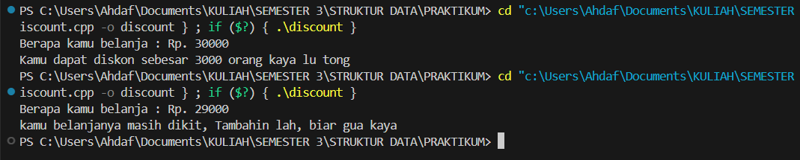
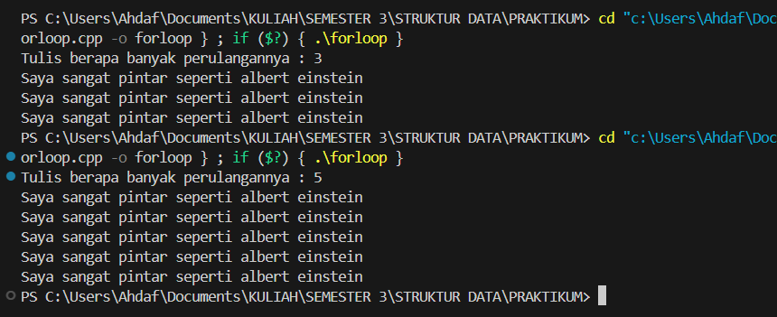
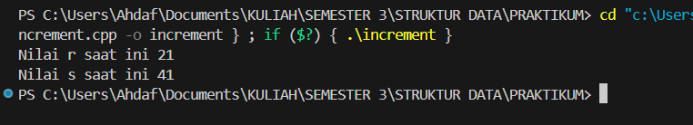
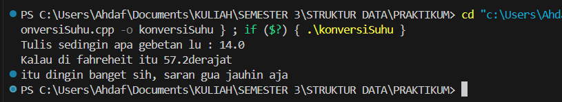
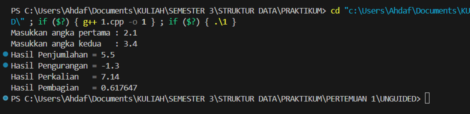
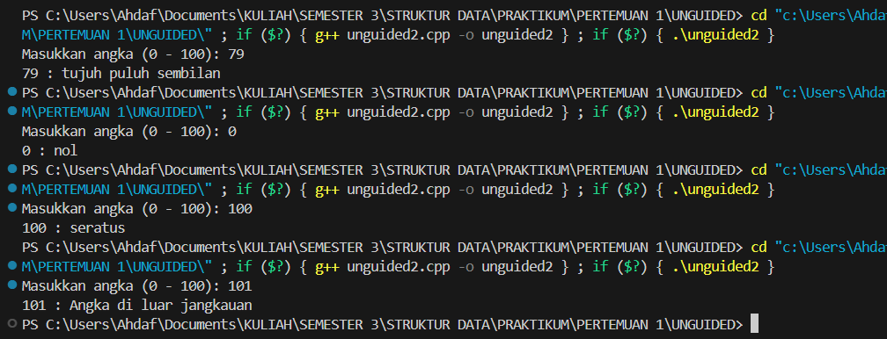
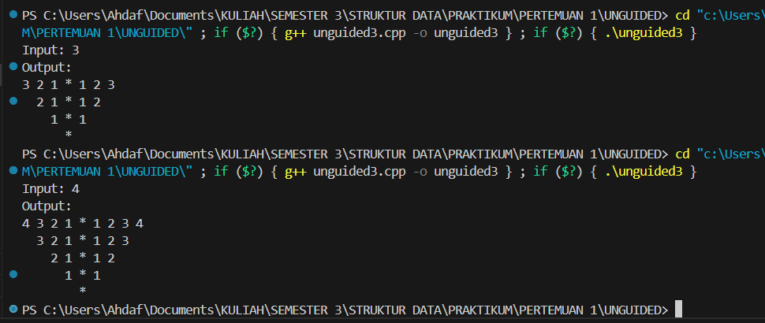

# Praktikum Struktur Data
---
## 1. Nama, NIM, Kelas
---
- **Nama**: Rahmat Ahdaf Albariza
- **NIM**: 103112430003
- **Kelas**: S1IF - 12 - 05 

## 2. Motivasi Belajar Struktur Data
---
Saya termotivasi mempelajari struktur data karena mata kuliah ini membantu saya memahami cara menyimpan dan mengolah data dengan lebih efisien. Pengetahuan ini penting, tidak hanya untuk menyelesaikan tugas kuliah, tetapi juga untuk membangun aplikasi atau sistem yang berguna di dunia nyata.

## 3. Dasar Teori
---
**Struktur data** adalah cara untuk menyimpan, mengatur, dan mengelola data di dalam komputer agar dapat digunakan secara efisien. Struktur data berperan penting dalam pemrosesan informasi dan menjadi dasar dari banyak algoritma. Berikut adalah beberapa teori dasar mengenai struktur data:
- **Array**: Struktur data yang menyimpan elemen dengan tipe data sama dalam urutan tertentu dan diakses menggunakan indeks.
- **Linked List**: Kumpulan simpul (node) yang saling terhubung melalui pointer, di mana setiap simpul berisi data dan alamat simpul berikutnya.
- **Stack**: Struktur data dengan prinsip _Last In First Out (LIFO)_, di mana elemen yang terakhir dimasukkan akan dikeluarkan terlebih dahulu.
- **Queue**: Struktur data dengan prinsip _First In First Out (FIFO)_, di mana elemen yang pertama dimasukkan akan dikeluarkan terlebih dahulu.
- **Graf**: Struktur data yang digunakan untuk menggambarkan hubungan antar objek yang disebut simpul (vertex) dan hubungan antar simpul yang disebut busur (edge).
- **Pohon (Tree)**: Struktur data hierarkis yang terdiri dari simpul dan tepi, dengan satu simpul sebagai akar (root) dan simpul lainnya sebagai anak.

## 4. Guided
---
### 4.1 Guided 1
discount
```cpp
#include <iostream>

  

using namespace std;

  

int main(){

    double total_pembelian,diskon;

    cout << "Berapa kamu belanja : Rp. ";

    cin >> total_pembelian;

    if (total_pembelian >= 30000){

        diskon = 0.1 * total_pembelian;

        cout << "Kamu dapat diskon sebesar " << diskon << "orang kaya lu tong ";

    } else {

        cout << "kamu belanjanya masih dikit, Tambahin lah, biar gua kaya";

    }

    return 0;

}
```
Output :
>

Penjelasan : 
Program ini fungsinya buat ngitung diskon belanja pake percabangan **if-else**. Pertama, program minta pengguna masukin total belanja. Kalau total belanjanya lebih dari atau sama dengan Rp30.000, program otomatis ngitung diskon 10% terus nampilin hasilnya. Tapi kalau belanjanya kurang dari itu, program cuma bilang kalau belanja terlalu sedikit jadi nggak dapet diskon.
### 4.2 Guided 2
forloop
```cpp
#include <iostream>

  

using namespace std;

  

int main(){

    int jumlah;

    cout << "Tulis berapa banyak perulangannya : ";

    cin >> jumlah;

    for (int i = 0; i<jumlah; i++){

        cout <<"Saya sangat pintar seperti albert einstein" << endl;

    }

    return 0;

}
```
Output : 
>

Penjelasan : 
Program ini fungsinya buat ngulangin kalimat pake perulangan **for**. Pertama, program minta pengguna masukin sebuah angka. Angka itu dipake buat nentuin berapa kali kalimat _“Saya sangat pintar seperti albert einstein”_ ditampilin ke layar. Jadi intinya, jumlah pengulangan sesuai sama angka yang dimasukin pengguna.
### 4.3 Guided 3
increment
```cpp
#include <iostream>

  

using namespace std;

  

int main(){

    int r = 20;

    int s;

  

    s = 20 + ++r; //r = 20 --> r++ = 20 + 1 == > s + 21 = 41

    cout << "Nilai r saat ini" <<r <<endl;

    cout << "Nilai s saat ini" <<s <<endl;

    return 0;

}
```
Output : 
>

Penjelasan : 
Program ini fungsinya buat nunjukin cara kerja operator **pre-increment (++r)**. Awalnya variabel `r` nilainya 20. Pas ada perintah `s = 20 + ++r`, nilai `r` ditambah dulu jadi 21 baru terus dihitung. Hasilnya, `s` jadi 41 dan `r` juga jadi 21. Terakhir, program nampilin kedua nilai itu ke layar.
### 4.4 Guided 4
konversiSuhu
```cpp
#include <iostream>

  

using namespace std;

  

int main(){

    float celcius,fahrenheit;

    cout << "Tulis sedingin apa gebetan lu : ";

    cin >> celcius;

    fahrenheit = (9.0/5.0)* celcius + 32;

    cout << "Kalau di fahreheit itu " << fahrenheit << "derajat" <<endl;

    cout << "itu dingin banget sih, saran gua jauhin aja";

    return 0;

}
```
Output : 
>

Penjelasan : 
Program ini fungsinya buat ngubah suhu dari Celcius ke Fahrenheit. Pertama, program bakal minta kita masukin berapa suhu dalam Celcius. Angka yang dimasukin itu terus dihitung pake rumus `(9.0/5.0) * celcius + 32` buat dapetin hasil dalam Fahrenheit. Setelah itu, hasil konversinya langsung ditampilin ke layar lengkap sama pesan tambahan.

## 5. Unguided
### 5.1 Unguided 1
```cpp
#include <iostream>

  

using namespace std;

  

int main() {

    float angka1, angka2;

    // input

    cout << "Masukkan angka pertama : ";

    cin >> angka1;

    cout << "Masukkan angka kedua   : ";

    cin >> angka2;

    // proses dan output

    cout << "Hasil Penjumlahan = " << angka1 + angka2 << endl;

    cout << "Hasil Pengurangan = " << angka1 - angka2 << endl;

    cout << "Hasil Perkalian   = " << angka1 * angka2 << endl;

    cout << "Hasil Pembagian   = " << angka1 / angka2 << endl;

  

    return 0;

}
```
Output : 
>

Penjelasan : 
Program ini fungsinya buat ngitung operasi hitung sederhana dari dua angka. Pertama, program bakal minta kita masukin dua angka, terus disimpen di variabel `angka1` sama `angka2`. Setelah itu program langsung ngitung hasil tambah, kurang, kali, sama bagi dari angka yang kita masukin tadi. Terakhir, semua hasil perhitungannya ditampilin ke layar.

### 5.2 Unguided 2
```cpp
#include <iostream>

using namespace std;

int main() {
    int angka;

    // daftar kata untuk angka satuan (0 - 9)
    string satuan[] = {"nol","satu","dua","tiga","empat","lima","enam","tujuh","delapan","sembilan"};

    // daftar kata untuk angka belasan (10 - 19)
    string belasan[] = {"sepuluh","sebelas","dua belas","tiga belas","empat belas","lima belas",
                        "enam belas","tujuh belas","delapan belas","sembilan belas"};

    // daftar kata untuk angka puluhan (20, 30, 40, dst)
    string puluhan[] = {"","sepuluh","dua puluh","tiga puluh","empat puluh",
                        "lima puluh","enam puluh","tujuh puluh","delapan puluh","sembilan puluh"};

    // minta input angka dari user
    cout << "Masukkan angka (0 - 100): ";
    cin >> angka;

    // tampilkan angka yang dimasukin
    cout << angka << " : ";

    // cek kondisi angka
    if(angka < 10){
        // kalau 0 - 9 langsung ambil dari array satuan
        cout << satuan[angka];
    } else if(angka < 20){
        // kalau 10 - 19 ambil dari array belasan
        cout << belasan[angka-10];
    } else if(angka < 100){
        // kalau 20 - 99, ambil puluhannya
        cout << puluhan[angka/10] << " ";
        // kalau ada sisa satuan, tambahin
        if(angka % 10 != 0){
            cout << satuan[angka%10];
        }
    } else if(angka == 100){
        // khusus angka 100 langsung ditulis "seratus"
        cout << "seratus";
    } else {
        // kalau lebih dari 100 ditolak
        cout << "Angka di luar jangkauan";
    }

    cout << endl;
    return 0;
}

```
Output : 
>

Penjelasan : 
Program ini fungsinya buat ngubah angka jadi tulisan. Jadi kalau kita masukin angka dari 0 sampai 100, nanti keluar hasilnya dalam bentuk kata. Di dalam program ada tiga daftar kata: yang pertama buat angka satuan (0–9), yang kedua buat angka belasan (10–19), dan yang ketiga buat angka puluhan (20, 30, 40, dst). Cara kerjanya gini: kalau angka kurang dari 10, program langsung ambil dari daftar satuan. Kalau angkanya antara 10 sampai 19, program ambil dari daftar belasan. Kalau angkanya 20 sampai 99, program ambil dulu puluhannya, terus kalau ada sisa satuannya ditambahin lagi. Kalau angkanya 100 langsung ditulis “seratus”. Tapi kalau masukin angka lebih dari 100, program bakal bilang angkanya di luar jangkauan. Jadi intinya program ini cuma ngeubah angka jadi tulisan biar lebih gampang dibaca.

### 5.3 Unguided 3
```cpp
#include <iostream>

  

using namespace std;

  

int main() {

    int n;

    cout << "Input: ";

    cin >> n;

  

    cout << "Output:" << endl;

  

    for (int i = n; i >= 0; i--) {

        // kasih spasi biar rata kanan

        for (int spasi = 0; spasi < n - i; spasi++) {

            cout << "  "; // 2 spasi biar rapi

        }

  

        // cetak angka menurun

        for (int j = i; j >= 1; j--) {

            cout << j << " ";

        }

  

        // cetak tanda *

        cout << "* ";

  

        // cetak angka menaik

        for (int j = 1; j <= i; j++) {

            cout << j << " ";

        }

  

        cout << endl;

    }

  

    return 0;

}
```
Output : 
>

Penjelasan : 
Program ini gunanya buat bikin pola angka dan tanda bintang yang bentuknya mirip segitiga terbalik. Pertama, kita disuruh masukin sebuah angka `n`. Dari angka itu, program bikin baris dari `n` sampai 0. Tiap barisnya diawali sama spasi biar posisinya miring ke kanan, terus program cetak angka turun, lalu tanda `*`, terus angka naik lagi. Karena setiap baris jumlah angkanya makin sedikit dan bergeser ke kanan, hasil akhirnya keliatan kayak segitiga terbalik.
## 6. Kesimpulan
Praktikum ini fungsinya buat latihan dasar pemrograman C++ sambil belajar konsep yang ada di struktur data. Dari percabangan aku bisa ngerti gimana program milih jalannya, dari perulangan aku bisa bikin sesuatu ditampilin berkali-kali, terus dari operasi sederhana aku bisa ngitung langsung di program. Ada juga latihan konversi, ngubah angka jadi tulisan, sampai bikin pola angka biar lebih kebayang gimana logika program jalan. Jadi intinya, lewat praktikum ini aku jadi lebih paham cara ngaitin teori sama praktik, dan tujuan praktikum bisa dibilang tercapai.

## 7. Referensi
https://www.hostinger.com/id/tutorial/apa-itu-struktur-data
https://www.dicoding.com/blog/struktur-data-pengertian-fungsi-dan-penerapannya/
https://www.w3schools.com/cpp/default.asp
