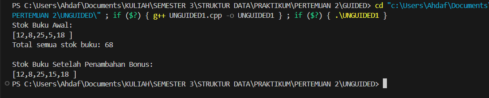

# Praktikum Struktur Data
## 1. Nama, NIM, Kelas
- **Nama**: Rahmat Ahdaf Albariza
- **NIM**: 103112430003
- **Kelas**: S1IF - 12 - 05 

## 2. Motivasi Belajar Struktur Data
Saya termotivasi mempelajari struktur data karena mata kuliah ini membantu saya memahami cara menyimpan dan mengolah data dengan lebih efisien. Pengetahuan ini penting, tidak hanya untuk menyelesaikan tugas kuliah, tetapi juga untuk membangun aplikasi atau sistem yang berguna di dunia nyata.

## 3. Dasar Teori
**Struktur data** adalah cara untuk menyimpan, mengatur, dan mengelola data di dalam komputer agar dapat digunakan secara efisien. Struktur data berperan penting dalam pemrosesan informasi dan menjadi dasar dari banyak algoritma. Berikut adalah beberapa teori dasar mengenai struktur data:
- **Array**: Struktur data yang menyimpan elemen dengan tipe data sama dalam urutan tertentu dan diakses menggunakan indeks.
- **Linked List**: Kumpulan simpul (node) yang saling terhubung melalui pointer, di mana setiap simpul berisi data dan alamat simpul berikutnya.
- **Stack**: Struktur data dengan prinsip _Last In First Out (LIFO)_, di mana elemen yang terakhir dimasukkan akan dikeluarkan terlebih dahulu.
- **Queue**: Struktur data dengan prinsip _First In First Out (FIFO)_, di mana elemen yang pertama dimasukkan akan dikeluarkan terlebih dahulu.
- **Graf**: Struktur data yang digunakan untuk menggambarkan hubungan antar objek yang disebut simpul (vertex) dan hubungan antar simpul yang disebut busur (edge).
- **Pohon (Tree)**: Struktur data hierarkis yang terdiri dari simpul dan tepi, dengan satu simpul sebagai akar (root) dan simpul lainnya sebagai anak.

## 4. Guided
### 4.1 Guided 1
```cpp
#include <iostream>

  

using namespace std;

  

int main(){

    int bukuPerHari[7] = {2, 1, 3, 2, 4, 5, 1};

    int totalBuku = 0;

  

    cout << "Laporan Baca Buku Mingguan" << endl;

  

    // Mengakses setiap elemen array menggunakan loop

    for (int  i = 0; i < 7; i++){

        // Mencetak nilai dari elemen pada indeks ke-i.

        cout << "Hari ke-" << i + 1 << " : " << bukuPerHari[i]

        <<" buku." << endl;

        totalBuku += bukuPerHari[i];

    }

    cout << "Total buku yang dibaca minggu ini : " << totalBuku

    << " buku." << endl;

}
```
Output :
>

Penjelasan : 
Program ini fungsinya buat ngitung total buku yang dibaca selama satu minggu dan nampilin laporan per harinya.  
Pertama, program nyimpen jumlah buku yang dibaca tiap hari dalam sebuah array bernama `bukuPerHari`, isinya ada 7 data (karena seminggu ada 7 hari).  
Terus, ada variabel `totalBuku` buat nyimpen total keseluruhan buku yang dibaca.

Program kemudian nampilin judul **"Laporan Baca Buku Mingguan"**, lalu masuk ke perulangan `for` yang jalan dari hari ke-1 sampai ke-7.  
Di dalam loop itu, program bakal menampilkan jumlah buku yang dibaca di setiap hari (`bukuPerHari[i]`), sekaligus menambahkan jumlahnya ke variabel `totalBuku`.
Setelah loop selesai, program bakal nampilin total semua buku yang sudah dibaca selama seminggu.
### 4.2 Guided 2
```cpp
#include <iostream>

  

using namespace std;

  

int main(){

    float hargaProduk = 50000.0f;

    // Deklarasi pointer.

    float*ptrHarga;

    ptrHarga = &hargaProduk;

  

    cout << "Harga awal produk: Rp" << hargaProduk << endl;

    cout << "Alamat memori harga: " << ptrHarga << endl;

  

    cout << "\n...Memberikan diskon 10% melalui pointer..." << endl;

  

    *ptrHarga = *ptrHarga * 0.9;

    cout << "Harga setelah diskon: Rp " << hargaProduk << endl;

    return 0;

}
```
Output : 
>

Penjelasan : 
Program ini fungsinya buat nunjukin gimana cara kerja pointer di C++.  
Pertama, program nyimpen harga produk sebesar Rp50.000 dalam variabel `hargaProduk`.  
Lalu dibuat pointer bernama `ptrHarga` yang isinya adalah alamat memori dari `hargaProduk`. Jadi, pointer ini nggak nyimpen nilai harganya langsung, tapi nyimpen posisi di mana nilai itu berada di memori komputer.

Setelah itu, program nampilin harga awal produk dan alamat memorinya.  
Kemudian ada proses pemberian diskon 10% yang dilakukan **melalui pointer**, bukan langsung dari variabelnya.  
Baris `*ptrHarga = *ptrHarga * 0.9;` berarti program ngambil nilai dari alamat yang ditunjuk pointer (yaitu `hargaProduk`), terus dikali 0.9 buat ngasih diskon.
Di akhir, program nampilin harga produk yang udah didiskon, yaitu Rp45.000.
### 4.3 Guided 3
```cpp
#include <iostream>

#include <string>

using namespace std;

  

float hitungRataRata(int nilaiTugas, int nilaiUTS){

    return (nilaiTugas + nilaiUTS) / 2.0f;

}

  

void cetakProfil(string nama, float nilai){

    cout << "Nama : " << nama << endl;

    cout << "nilai : " << nilai << endl;

}

  

void beriNilaiBonus(float &nilai){

    nilai += 5.0f;

}

  

int main(){

    string namaSiswa = "Budi";

    int tugas = 80, uts = 90;

  

    float nilaiAkhir = hitungRataRata(tugas, uts);

  

    cout << "Profil Awal" << endl;

    cetakProfil(namaSiswa, nilaiAkhir);

  

    cout << "\nMemberikan nilai bonus..." << endl;

    beriNilaiBonus(nilaiAkhir);

  

    cout << "\nProfil Setelah Bonus" << endl;

    cetakProfil(namaSiswa, nilaiAkhir);

  

    return 0;

}
```
Output : 
>

Penjelasan : 
Program ini fungsinya buat ngitung rata-rata nilai seorang siswa, terus nambahin nilai bonus, dan nampilin hasilnya sebelum dan sesudah bonus.

Pertama, program punya tiga fungsi tambahan.  
Fungsi **`hitungRataRata`** dipakai buat ngitung rata-rata dari nilai tugas dan nilai UTS.  
Fungsi **`cetakProfil`** dipakai buat nampilin nama siswa dan nilai akhirnya.  
Sedangkan fungsi **`beriNilaiBonus`** dipakai buat nambahin nilai sebesar 5 poin, dan karena pakai tanda `&` (referensi), perubahan nilainya langsung berpengaruh ke variabel aslinya.

Di bagian utama program (`main`), dibuat data siswa bernama **Budi** dengan nilai tugas 80 dan UTS 90.  
Program ngitung rata-ratanya, hasilnya 85, lalu nampilin profil awalnya.  
Setelah itu, program ngasih bonus nilai 5 poin lewat fungsi `beriNilaiBonus`, jadi nilainya naik jadi 90.  
Terakhir, program nampilin lagi profil siswa setelah dikasih bonus.
## 5. Unguided
### 5.1 Unguided 1
```cpp
#include <iostream>

using namespace std;

  

void cetakStok(int arr[], int size) {

    cout << "[";

    for (int i = 0; i < size; i++) {

        cout << arr[i] << (i == size-1?" ": ",");

    }

    cout << "]" << endl;

}

  

int hitungTotalStok(int arr[], int size) {

    int total = 0;

    for (int i = 0; i < size; i++) {

    total += arr[i];

    }

    return total;

}

  

int* cariStokPalingSedikit(int arr[], int size) {

    int* ptrPalingSedikit = &arr[0];

  

    for (int i = 1; i < size; i++) {

        if (arr[i] <*ptrPalingSedikit) {

            ptrPalingSedikit = &arr[i];

        }

    }

    return ptrPalingSedikit;

}

  

void tambahStokBonus(int* ptrStok) {

    *ptrStok += 10; // Menambahkan 10 ke nilai yang ditunjuk oleh pointer.

}

  
  

int main() {

    int stokBuku[] = {12, 8, 25, 5, 18};

    int jumlahJenisBuku = 5;

  

    cout << "Stok Buku Awal:" << endl;

    cetakStok(stokBuku, jumlahJenisBuku);

  

    int total = hitungTotalStok(stokBuku, jumlahJenisBuku);

    cout << "Total semua stok buku: " << total << endl;

  

    int* ptrStokRendah = cariStokPalingSedikit (stokBuku, jumlahJenisBuku);

  

    tambahStokBonus(ptrStokRendah);

  

    cout << "\nStok Buku Setelah Penambahan Bonus:" << endl;

    cetakStok(stokBuku, jumlahJenisBuku);

  

return 0;

}
```
Output : 
>

Penjelasan : 
Program ini fungsinya buat ngatur data stok buku di sebuah toko, mulai dari nampilin daftar stok, ngitung totalnya, nyari stok yang paling sedikit, sampai nambahin stok bonus ke buku yang stoknya paling rendah.

Pertama, program punya beberapa fungsi bantu.  
Fungsi **`cetakStok`** dipakai buat nampilin semua jumlah stok buku dalam bentuk daftar.  
Fungsi **`hitungTotalStok`** dipakai buat ngitung total keseluruhan stok dari semua jenis buku.  
Fungsi **`cariStokPalingSedikit`** dipakai buat nyari buku yang stoknya paling sedikit dengan bantuan pointer, supaya bisa tau alamat data yang mau diubah.  
Lalu fungsi **`tambahStokBonus`** dipakai buat nambahin 10 stok ke buku yang stoknya paling sedikit, dan karena pake pointer, perubahan nilainya langsung berlaku di data utama.

Di bagian utama program (`main`), data stok buku disimpan dalam array `{12, 8, 25, 5, 18}`.  
Pertama, program nampilin stok awal, terus ngitung total semua stok.  
Setelah itu, program nyari buku yang stoknya paling sedikit (yaitu 5), lalu nambahin 10 stok bonus ke buku itu.  
Terakhir, program nampilin lagi daftar stok buku setelah ditambah bonus — hasilnya, stok yang tadinya 5 jadi 15.
## 6. Kesimpulan
Dari praktikum ini dapat disimpulkan bahwa penggunaan **array dan pointer** sangat penting dalam pengelolaan data di C++. Dengan memahami cara kerja pointer, kita bisa mengakses dan memodifikasi data secara langsung melalui alamat memori, tanpa harus menyalin nilainya.  
Program yang dibuat berhasil menunjukkan cara menampilkan data stok buku, menghitung total stok, mencari nilai terkecil, dan memperbarui nilainya menggunakan pointer.  
Melalui latihan ini, konsep dasar seperti **fungsi, array, referensi, dan pointer** dapat dipahami secara praktis serta diterapkan untuk memanipulasi data dalam program secara efisien.

## 7. Referensi
https://www.w3schools.com/cpp/default.asp
https://www.tutorialspoint.com/cplusplus/cpp_pointers.htm
https://www.programiz.com/cpp-programming/pointers-arrays