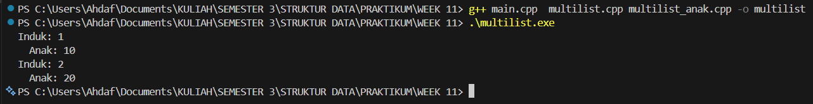
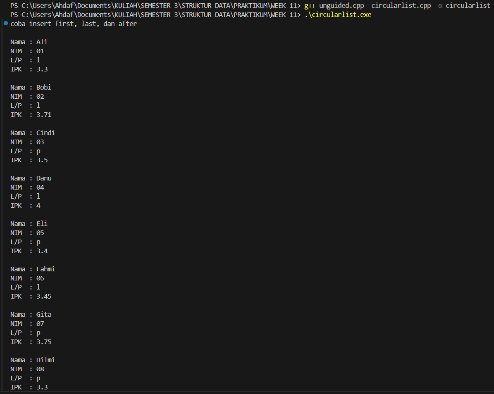

# Praktikum Struktur Data
## 1. Nama, NIM, Kelas
- **Nama**: Rahmat Ahdaf Albariza
- **NIM**: 103112430003
- **Kelas**: S1IF - 12 - 05 

## 2. Motivasi Belajar Struktur Data
Saya termotivasi mempelajari struktur data karena mata kuliah ini membantu saya memahami cara menyimpan dan mengolah data dengan lebih efisien. Pengetahuan ini penting, tidak hanya untuk menyelesaikan tugas kuliah, tetapi juga untuk membangun aplikasi atau sistem yang berguna di dunia nyata.

## 3. Dasar Teori
Multi Linked List adalah struktur data yang setiap elemen atau node-nya memiliki lebih dari satu pointer sebagai penghubung antar node. Tidak seperti singly linked list yang hanya memiliki satu pointer `next`, pada multi linked list setiap node dapat memiliki dua atau lebih pointer, seperti `next`, `prev`, `up`, atau `down`, tergantung kebutuhan struktur. Keberadaan beberapa pointer ini memungkinkan pembentukan hubungan data yang lebih kompleks, misalnya untuk merepresentasikan struktur hierarki, sparse matrix, atau adjacency list pada graf. Multi linked list bersifat dinamis dan fleksibel, karena ukuran list dapat berubah sesuai kebutuhan saat program berjalan. Namun demikian, penggunaan banyak pointer membuat struktur ini lebih rumit dalam implementasi, membutuhkan memori lebih besar, serta rentan terhadap kesalahan jika pointer tidak dikelola dengan tepat. Meskipun demikian, kelebihan utamanya adalah kemampuan untuk mengakses data melalui beberapa arah dan menyusun struktur data non-linear secara efisien.

Circular Linked List adalah variasi dari linked list di mana node terakhir tidak menunjuk ke `NULL`, melainkan kembali ke node pertama sehingga membentuk struktur melingkar. Pada circular singly linked list, pointer `next` dari elemen terakhir mengarah ke head, sedangkan pada circular doubly linked list, pointer `next` dari node terakhir mengarah ke head dan pointer `prev` dari head mengarah kembali ke node terakhir. Ketiadaan pointer yang bernilai `NULL` membuat traversal dapat dilakukan secara terus-menerus tanpa titik akhir. Struktur circular linked list banyak digunakan pada sistem yang memerlukan proses berulang atau rotasi data, seperti pada round-robin scheduling, sistem antrian siklik, atau permainan yang melibatkan giliran secara melingkar. Walaupun memiliki kelebihan berupa efisiensi dalam proses perputaran data dan kemudahan traversal, circular linked list juga memiliki kekurangan, seperti potensi terjadinya infinite loop apabila kondisi pemberhentian tidak didefinisikan dengan jelas, serta kompleksitas yang sedikit lebih tinggi pada proses penyisipan dan penghapusan node dibandingkan linked list biasa.

## 4. Guided
### 4.1 Guided 1
```cpp
#ifndef MULTILIST_H_INCLUDED
#define MULTILIST_H_INCLUDED
#define Nil NULL

typedef int infotype;
typedef struct elemen_induk *address_induk;
typedef struct elemen_anak *address_anak;

struct elemen_anak {
    infotype info;
    address_anak next, prev;
};

struct list_anak {
    address_anak first, last;
};

struct elemen_induk {
    infotype info;
    list_anak anak;
    address_induk next, prev;
};

struct list_induk {
    address_induk first, last;
};

void createList(list_induk &L);
address_induk alokasi(infotype x);
void insertLastInduk(list_induk &L, address_induk P);
address_induk findInduk(list_induk L, infotype x);
void insertLastAnak(list_anak &LA, address_anak PA);
address_anak alokasiAnak(infotype x);
void printInfo(list_induk L);

#endif
```
Penjelasan : 
Program di atas (**Multilist.h**) adalah sebuah header file yang berisi struktur dasar untuk membuat **Multi Linked List**, yaitu struktur data yang punya dua tingkatan: list induk dan list anak. Setiap elemen induk bukan hanya menyimpan data biasa, tapi juga punya sebuah list anak di dalamnya. Jadi, satu induk bisa punya banyak anak yang terhubung seperti linked list pada umumnya. Baik elemen induk maupun elemen anak sama-sama dibuat sebagai **doubly linked list**, karena masing-masing elemen punya pointer `next` dan `prev` agar bisa bergerak maju atau mundur dalam list.

Struktur `list_induk` dan `list_anak` masing-masing menyimpan pointer `first` dan `last` sebagai penanda elemen pertama dan terakhir. Selain struktur datanya, header ini juga menyediakan deklarasi fungsi-fungsi penting. Fungsi `createList` dipakai untuk menyiapkan list induk agar siap digunakan. Fungsi `alokasi` dan `alokasiAnak` digunakan untuk membuat node baru berdasarkan nilai yang diberikan. Untuk menambahkan elemen, ada `insertLastInduk` dan `insertLastAnak` yang memasukkan node baru ke posisi paling belakang. Fungsi `findInduk` berguna untuk mencari data induk tertentu di dalam list, dan `printInfo` bertugas menampilkan isi list induk dan juga list anak-anak yang dimiliki tiap induk. Dengan kombinasi struktur dan fungsi-fungsi ini, program bisa mengelola data yang bertingkat dengan fleksibel dan mudah dikembangkan sesuai kebutuhan.
### 4.2 Guided 2
```cpp
#include "multilist.h"
#include <iostream>
using namespace std;

void createList(list_induk &L) {
    L.first = Nil;
    L.last = Nil;
}

address_induk alokasi(infotype x) {
    address_induk P = new elemen_induk;
    P->info = x;
    P->next = Nil;
    P->prev = Nil;
    P->anak.first = Nil;
    P->anak.last = Nil;
    return P;
}

void insertLastInduk(list_induk &L, address_induk P) {
    if (L.first == Nil) {
        L.first = P;
        L.last = P;
    } else {
        L.last->next = P;
        P->prev = L.last;
        L.last = P;
    }
}

address_induk findInduk(list_induk L, infotype x) {
    address_induk P = L.first;
    while (P != Nil) {
        if (P->info == x) return P;
        P = P->next;
    }
    return Nil;
}
```
Penjelasan : 
Program di atas (**Multilist.cpp**) berisi beberapa fungsi dasar untuk mengelola **list induk** pada struktur Multi Linked List. Fungsi `createList` dipakai untuk mengosongkan list di awal dengan mengatur `first` dan `last` menjadi `Nil`, supaya list siap digunakan. Selanjutnya ada fungsi `alokasi`, yang tugasnya bikin node induk baru berdasarkan nilai `x` yang diberikan. Di fungsi ini, node baru diisi dengan data `info`, semua pointer (`next`, `prev`) diset ke `Nil`, dan list anak di dalamnya juga dikosongkan, jadi node benar-benar siap dimasukkan ke list.

Fungsi `insertLastInduk` digunakan buat menambahkan node induk ke bagian paling belakang list. Kalau list masih kosong, node baru langsung jadi elemen pertama dan terakhir. Tapi kalau list sudah ada isinya, pointer `next` dari elemen terakhir dihubungkan ke node baru, dan pointer `prev` dari node baru diset mengarah ke elemen sebelumnya, lalu `last` diperbarui menjadi node tersebut. Lalu ada fungsi `findInduk`, yang fungsinya mencari node induk berdasarkan nilai `info`. Fungsi ini bakal nge-loop dari elemen pertama sampai ketemu data yang dicari. Kalau ketemu, node tersebut langsung dikembalikan; kalau nggak ketemu sampai akhir list, hasilnya `Nil`.
### 4.3 Guided 3
```cpp
#include "multilist.h"
#include <iostream>
using namespace std;

address_anak alokasiAnak(infotype x) {
    address_anak P = new elemen_anak;
    P->info = x;
    P->next = Nil;
    P->prev = Nil;
    return P;
}

void insertLastAnak(list_anak &LA, address_anak PA) {
    if (LA.first == Nil) {
        LA.first = PA;
        LA.last = PA;
    } else {
        LA.last->next = PA;
        PA->prev = LA.last;
        LA.last = PA;
    }
}

void printInfo(list_induk L) {
    address_induk PI = L.first;
    while (PI != Nil) {
        cout << "Induk: " << PI->info << endl;
        address_anak PA = PI->anak.first;
        while (PA != Nil) {
            cout << "  Anak: " << PA->info << endl;
            PA = PA->next;
        }
        PI = PI->next;
    }
}
```
Penjelasan : 
Bagian program ini (**multilist_anak.cpp**) berisi fungsi-fungsi yang dipakai untuk mengelola **list anak** dalam struktur Multi Linked List. Fungsi `alokasiAnak` digunakan untuk membuat node anak baru berdasarkan nilai `x` yang diberikan. Ketika node baru dibuat, data `info` diisi sesuai input, lalu pointer `next` dan `prev` diset ke `Nil` supaya node siap dimasukkan ke list. Setelah itu ada fungsi `insertLastAnak`, yang fungsinya menambahkan node anak baru di posisi paling belakang list anak. Kalau list anak masih kosong, node yang dimasukkan langsung jadi elemen pertama dan terakhir. Tapi kalau list sudah ada isinya, node baru dihubungkan ke node terakhir melalui pointer `next`, dan pointer `prev` juga diset ke elemen sebelumnya, lalu elemen tersebut dijadikan `last`.

Fungsi berikutnya adalah `printInfo`, yang digunakan untuk menampilkan seluruh isi multilist, mulai dari induknya sampai anak-anaknya. Prosesnya dilakukan dengan looping dari node induk pertama, lalu setiap elemen induk dicetak nilai datanya. Setelah itu, program masuk ke list anak milik induk tersebut dan mencetak satu per satu nilai anak hingga habis. Setelah semua anak dicetak, program lanjut ke induk berikutnya sampai seluruh daftar selesai ditampilkan. Secara keseluruhan, fungsi-fungsi ini membantu menambahkan node anak dan menampilkan struktur multilist dengan rapi, sehingga hubungan induk–anak bisa terlihat jelas saat program dijalankan.
### 4.4 Guided 4
```cpp
#include "multilist.h"
#include <iostream>
using namespace std;

int main() {
    list_induk L;
    createList(L);

    address_induk P1 = alokasi(1);
    insertLastInduk(L, P1);

    address_anak PA1 = alokasiAnak(10);
    insertLastAnak(P1->anak, PA1);

    address_induk P2 = alokasi(2);
    insertLastInduk(L, P2);

    address_anak PA2 = alokasiAnak(20);
    insertLastAnak(P2->anak, PA2);

    printInfo(L);
    return 0;
}
```
Output : 
>

Penjelasan : 
Program di atas menunjukkan cara menggunakan struktur **Multi Linked List** yang sudah dibuat sebelumnya. Pertama, program membuat sebuah list induk `L` dan menginisialisasinya dengan `createList` supaya list dalam keadaan kosong dan siap dipakai. Setelah itu, program membuat node induk pertama dengan nilai `1` menggunakan `alokasi`, lalu node ini dimasukkan ke bagian belakang list induk lewat `insertLastInduk`. Kemudian, dibuat satu node anak dengan nilai `10`, dan node anak ini dimasukkan ke dalam list anak milik induk pertama menggunakan `insertLastAnak`. Proses yang sama dilakukan lagi untuk induk kedua: program membuat node induk dengan nilai `2`, memasukkannya ke list induk, lalu membuat anak dengan nilai `20` dan menambahkannya ke list anak milik induk kedua.

Setelah semua induk dan anak dimasukkan, program memanggil `printInfo(L)` untuk menampilkan isi multilist. Saat dijalankan, output akan menunjukkan data induk beserta daftar anaknya—induk pertama punya anak 10, dan induk kedua punya anak 20.
## 5. Unguided
### 5.1 Unguided 1
```cpp
#ifndef CIRCULARLIST_H_INCLUDED
#define CIRCULARLIST_H_INCLUDED

#include <iostream>
using namespace std;

#define Nil NULL

// TIPE DATA
typedef struct {
    string nama;
    string nim;
    char jenis_kelamin;
    float ipk;
} infotype;

typedef struct ElmList *address;

struct ElmList {
    infotype info;
    address next;
};

struct List {
    address first;
};

// FUNGSI / PROSEDUR
void createList(List &L);
address alokasi(infotype x);
void dealokasi(address P);

void insertFirst(List &L, address P);
void insertAfter(List &L, address Prec, address P);
void insertLast(List &L, address P);

void deleteFirst(List &L, address &P);
void deleteAfter(List &L, address Prec, address &P);
void deleteLast(List &L, address &P);

address findElm(List L, infotype x);
void printInfo(List L);

#endif

```
Penjelasan:
Program header **circularlist.h** ini intinya nyiapin “kerangka” buat bikin dan ngatur **Circular Linked List** yang isinya data mahasiswa. Jadi di sini belum ada kode logika lengkapnya, tapi udah dideklarasiin semua tipe data dan fungsi yang bakal dipakai di file `.cpp`. Pertama, dibuat dulu tipe data `infotype` yang isinya atribut mahasiswa: nama, nim, jenis kelamin, sama IPK. Terus ada `ElmList`, yaitu node tunggal dari linked list yang nyimpen satu data mahasiswa plus pointer `next` yang nunjuk ke node berikutnya. Karena ini circular list, node terakhir nantinya bakal nyambung lagi ke node pertama. Struktur `List` sendiri cuma punya satu pointer `first` yang nunjuk ke elemen pertama.

Di bawahnya ada daftar fungsi yang nanti dipake buat ngelola list-nya: mulai dari bikin list kosong (`createList`), ngasih memori buat elemen baru (`alokasi`), sampai ngelepas memori (`dealokasi`). Ada juga fungsi buat masukin elemen di depan (`insertFirst`), setelah elemen tertentu (`insertAfter`), atau paling belakang (`insertLast`). Kalau mau ngapus elemen, udah disiapin juga `deleteFirst`, `deleteAfter`, dan `deleteLast`. Ada fungsi `findElm` buat nyari data berdasarkan nim, dan terakhir `printInfo` buat nampilin isi list. Intinya, file header ini kayak daftar menu — semua fungsi udah disiapin deklarasinya, tinggal diimplementasiin di file `.cpp`.


```cpp
#include "circularlist.h"

void createList(List &L){
    L.first = Nil;
}

address alokasi(infotype x){
    address P = new ElmList;
    P->info = x;
    P->next = Nil;
    return P;
}

void dealokasi(address P){
    delete P;
}

void insertFirst(List &L, address P){
    if(L.first == Nil){
        L.first = P;
        P->next = P;
    } else {
        address Q = L.first;
        while(Q->next != L.first){
            Q = Q->next;
        }
        Q->next = P;
        P->next = L.first;
        L.first = P;
    }
}

void insertAfter(List &L, address Prec, address P){
    if(Prec != Nil){
        P->next = Prec->next;
        Prec->next = P;
    }
}

void insertLast(List &L, address P){
    if(L.first == Nil){
        insertFirst(L, P);
    } else {
        address Q = L.first;
        while(Q->next != L.first){
            Q = Q->next;
        }
        Q->next = P;
        P->next = L.first;
    }
}

void deleteFirst(List &L, address &P){
    P = L.first;

    if(P->next == P){     // 1 elemen
        L.first = Nil;
    } else {
        address Q = L.first;
        while(Q->next != L.first){
            Q = Q->next;
        }
        L.first = P->next;
        Q->next = L.first;
    }
    P->next = Nil;
}

void deleteAfter(List &L, address Prec, address &P){
    P = Prec->next;

    if(P != Nil){
        Prec->next = P->next;
        P->next = Nil;
    }
}

void deleteLast(List &L, address &P){
    if(L.first->next == L.first){   // satu elemen
        deleteFirst(L, P);
    } else {
        address Q = L.first;
        while(Q->next->next != L.first){
            Q = Q->next;
        }
        P = Q->next;
        Q->next = L.first;
        P->next = Nil;
    }
}

address findElm(List L, infotype x){
    if(L.first == Nil) return Nil;

    address P = L.first;
    do{
        if(P->info.nim == x.nim){
            return P;
        }
        P = P->next;
    } while(P != L.first);

    return Nil;
}

void printInfo(List L){
    if(L.first == Nil){
        cout << "List kosong" << endl;
        return;
    }

    address P = L.first;

    do {
        cout << "Nama : " << P->info.nama << endl;
        cout << "NIM  : " << P->info.nim << endl;
        cout << "L/P  : " << P->info.jenis_kelamin << endl;
        cout << "IPK  : " << P->info.ipk << endl;
        cout << endl;
        P = P->next;
    } while(P != L.first);
}

```
Penjelasan:
Program **circularlist.cpp** ini isinya implementasi lengkap dari semua fungsi yang sebelumnya sudah dideklarasiin di file header. Kalau di header tadi cuma “nyiapin rancangan”, nah di file .cpp inilah seluruh logika circular linked list-nya bener-bener dikerjain. Pertama ada `createList` yang tugasnya bikin list kosong dengan ngeset pointer `first` jadi `Nil`. Lalu `alokasi` dipakai buat bikin node baru lengkap sama datanya, dan `dealokasi` buat ngehapus node dari memori kalau udah nggak dipakai lagi.

Bagian insert mulai jalan dari sini. `insertFirst` nge-handle penempatan elemen di paling depan. Kalau list masih kosong, node baru langsung dibuat circular dengan nunjuk ke dirinya sendiri. Kalau list sudah berisi, program nyari node terakhir dulu lalu nyambungin node baru sebagai first, sambil tetep ngejaga supaya list tetap muter. `insertAfter` dipakai buat nyelipin node setelah node tertentu, sedangkan `insertLast` mirip insertFirst tapi penempatannya di bagian akhir list.

Bagian delete juga udah diimplementasiin detail. `deleteFirst` ngehapus elemen yang ada di depan dan otomatis memperbarui pointer node terakhir supaya tetap circular. `deleteAfter` ngapus node setelah node tertentu, dan `deleteLast` ngapus elemen paling belakang dengan cara nyari node sebelum elemen tersebut dulu. Terakhir ada `findElm` yang dipakai buat nyari mahasiswa berdasarkan nim dengan cara muter list sampai balik lagi ke elemen pertama, dan `printInfo` buat nampilin semua data mahasiswa dalam format yang udah ditentukan. Singkatnya, file .cpp ini adalah tempat seluruh “mesin kerja” dari circular linked list dijalankan—semua fungsi dari header diwujudkan sepenuhnya di sini.


```cpp
#include <iostream>
#include "circularlist.h"
using namespace std;

address createData(string nama, string nim, char jenis_kelamin, float ipk)
{
    infotype x;
    address P;

    x.nama = nama;
    x.nim = nim;
    x.jenis_kelamin = jenis_kelamin;
    x.ipk = ipk;

    P = alokasi(x);
    return P;
}

int main(){
    List L;
    address P1, P2;
    infotype x;

    createList(L);

    cout << "coba insert first, last, dan after" << endl << endl;

    // dasar: tambah beberapa elemen dengan insertFirst / insertLast
    P1 = createData("Danu", "04", 'l', 4.0);
    insertFirst(L, P1);

    P1 = createData("Fahmi", "06", 'l', 3.45);
    insertLast(L, P1);

    P1 = createData("Bobi", "02", 'l', 3.71);
    insertFirst(L, P1);

    P1 = createData("Ali", "01", 'l', 3.3);
    insertFirst(L, P1);

    P1 = createData("Gita", "07", 'p', 3.75);
    insertLast(L, P1);

    // 1) masukkan Cindi (03) setelah NIM "02" (Bobi)
    x.nim = "02";
    P1 = findElm(L, x);            // cari Bobi
    P2 = createData("Cindi", "03", 'p', 3.5);
    insertAfter(L, P1, P2);

    // 2) masukkan Hilmi (08) setelah NIM "07" (Gita)  -> jadi berada di akhir sesuai gambar
    x.nim = "07";
    P1 = findElm(L, x);            // cari Gita
    P2 = createData("Hilmi", "08", 'p', 3.3);
    insertAfter(L, P1, P2);

    // 3) masukkan Eli (05) setelah NIM "04" (Danu)
    x.nim = "04";
    P1 = findElm(L, x);            // cari Danu
    P2 = createData("Eli", "05", 'p', 3.4);
    insertAfter(L, P1, P2);

    printInfo(L);
    return 0;
}

```

Output : 
>

Penjelasan : 
Program **main.cpp** ini fungsinya buat ngetes semua operasi circular linked list yang sudah dibuat di file header dan file .cpp sebelumnya. Pertama ada fungsi `createData`, yang tugasnya cuma bikin satu data mahasiswa lengkap (nama, nim, jenis kelamin, IPK), lalu langsung ngasih node baru lewat pemanggilan `alokasi`. Jadi biar gampang, setiap mau nambah mahasiswa, cukup panggil `createData(...)` tanpa ribet ngisi struktur info secara manual.

Di dalam fungsi `main`, dibuat dulu sebuah list kosong dengan `createList(L)`. Setelah itu program mulai ngejalanin serangkaian operasi insert untuk nambah beberapa mahasiswa ke dalam list. Ada yang dimasukin pakai `insertFirst` (buat naruh di depan), ada juga yang pakai `insertLast` (buat naruh di belakang). Setelah data dasar dimasukin, program mulai nyisipin elemen-elemen tertentu pada posisi tertentu menggunakan `insertAfter`. Misalnya Cindi dimasukin setelah Bobi, Hilmi dimasukin setelah Gita, dan Eli dimasukin setelah Danu. Proses nyari posisi sisipnya dilakukan lewat `findElm` yang ngecek nim mahasiswa.

Setelah semua data berhasil disusun sesuai urutan yang diinginkan, program manggil `printInfo(L)` buat nampilin seluruh isi circular linked list dalam format yang rapi. Intinya, file main.cpp ini adalah bagian yang “mendemokan” cara kerja ADT circular linked list—mulai dari bikin node, nyisipin, ngatur urutan elemen, sampai nampilin hasil akhirnya ke layar.
## 6. Kesimpulan
Dari praktikum ini bisa disimpulkan kalau struktur data **Circular Linked List** dan **Multi Linked List** itu sebenarnya sangat fleksibel buat ngatur data yang saling terhubung. Circular list bikin proses traversal jadi lebih mudah karena elemen terakhir bakal balik lagi ke elemen pertama, jadi cocok banget buat sistem yang punya pola perulangan atau antrian melingkar. Multi linked list juga ngebantu buat nyimpen data yang punya hubungan hierarki, misalnya induk–anak.

Lewat implementasi yang udah dibuat, mulai dari header, file `.cpp`, sampai program uji di `main.cpp`, kita bisa lihat gimana proses alokasi memori, penyisipan data, penghapusan node, dan pencarian elemen semuanya dijalankan lewat pointer. Meskipun keliatan ribet di awal, tapi begitu paham alurnya, struktur data kayak gini justru jadi jauh lebih efisien dan gampang dikembangkan dibanding pakai struktur statis. Intinya, praktikum ini bikin pemahaman tentang linked list makin kuat, terutama soal logika pointer dan pengaturan hubungan antar node.

## 7. Referensi
https://www.w3schools.com/cpp/default.asp
