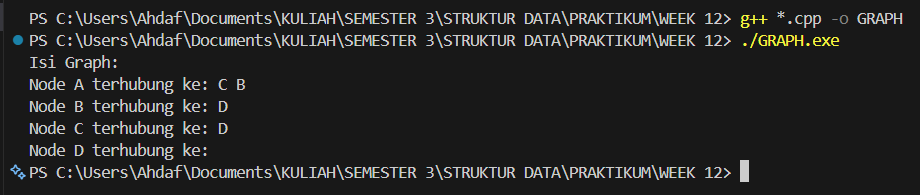
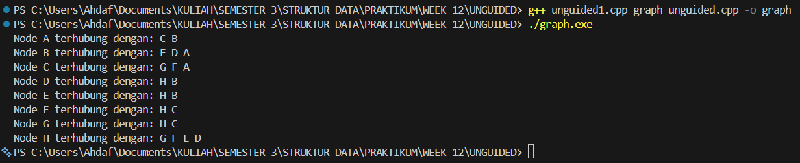
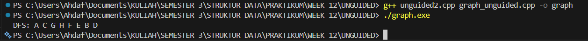
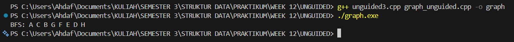

# Praktikum Struktur Data
## 1. Nama, NIM, Kelas
- **Nama**: Rahmat Ahdaf Albariza
- **NIM**: 103112430003
- **Kelas**: S1IF - 12 - 05 

## 2. Motivasi Belajar Struktur Data
Saya termotivasi mempelajari struktur data karena mata kuliah ini membantu saya memahami cara menyimpan dan mengolah data dengan lebih efisien. Pengetahuan ini penting, tidak hanya untuk menyelesaikan tugas kuliah, tetapi juga untuk membangun aplikasi atau sistem yang berguna di dunia nyata.

## 3. Dasar Teori
Graph merupakan salah satu struktur data non-linear yang digunakan untuk merepresentasikan hubungan antar objek. Secara formal, graph didefinisikan sebagai **G = (V, E)**, di mana **V (vertex)** adalah himpunan simpul dan **E (edge)** adalah himpunan sisi yang menghubungkan antar simpul. Graph dapat bersifat berarah atau tidak berarah, serta dapat berbobot maupun tidak berbobot, tergantung pada jenis hubungan yang ingin dimodelkan. Struktur data graph banyak digunakan untuk menggambarkan permasalahan dunia nyata seperti jaringan komputer, peta jalan, dan hubungan antar pengguna dalam media sosial.

Dalam implementasinya, graph dapat direpresentasikan menggunakan **adjacency matrix** atau **adjacency list**. Adjacency matrix menggunakan matriks dua dimensi untuk menunjukkan hubungan antar simpul, sedangkan adjacency list menyimpan daftar simpul yang terhubung pada setiap simpul. Selain itu, graph memiliki algoritma penelusuran seperti **Breadth First Search (BFS)** dan **Depth First Search (DFS)** yang digunakan untuk mengunjungi seluruh simpul dalam graph secara sistematis.

## 4. Guided
### 4.1 Guided 1
```cpp
#ifndef GRAPH_H
#define GRAPH_H
#include <iostream>
using namespace std;

typedef char infoGraph;
typedef struct ElmNode *adrNode;
typedef struct ElmEdge *adrEdge;

struct ElmNode{
    infoGraph info;
    bool visited;
    adrEdge firstEdge;
    adrNode next;
};

struct ElmEdge{
    adrNode node;
    adrEdge next;
};

struct Graph{
    adrNode first;
};

// Prototypes
void createGraph(Graph &G);
adrNode allocateNode(infoGraph X);
void insertNode(Graph &G, infoGraph X);
void connectNode(Graph &G, infoGraph start, infoGraph end);
void printGraph(Graph G);

#endif
```
Penjelasan : 
File graph.h ini berfungsi sebagai header untuk program graph yang dibuat menggunakan bahasa C++. Di dalam file ini terdapat pendefinisian struktur data yang digunakan untuk merepresentasikan graph dengan metode adjacency list. Graph dibentuk dari simpul (node) dan sisi (edge) yang saling terhubung. Tipe data infoGraph didefinisikan sebagai char, yang berarti setiap node dalam graph menyimpan satu karakter sebagai informasinya. Selain itu, digunakan juga pointer adrNode dan adrEdge untuk mempermudah pemanggilan alamat node dan edge.

Struktur ElmNode digunakan untuk merepresentasikan simpul pada graph, yang berisi data info, penanda visited untuk menandai apakah node sudah dikunjungi atau belum, pointer firstEdge yang menunjuk ke sisi pertama, serta pointer next untuk menghubungkan node satu dengan node lainnya. Struktur ElmEdge merepresentasikan sisi pada graph, yang menyimpan alamat node tujuan dan pointer ke sisi berikutnya. Selanjutnya, struktur Graph hanya memiliki satu pointer first yang menunjuk ke node pertama dalam graph. Di bagian akhir file ini juga terdapat prototype fungsi seperti createGraph, insertNode, connectNode, dan printGraph yang nantinya digunakan untuk membuat graph, menambah node, menghubungkan node, serta menampilkan isi graph.
### 4.2 Guided 2
```cpp
#include "graph.h"

void createGraph(Graph &G) {
    G.first = NULL;
}

adrNode allocateNode(infoGraph X) {
    adrNode P = new ElmNode;
    P->info = X;
    P->visited = false;
    P->firstEdge = NULL;
    P->next = NULL;
    return P;
}

void insertNode(Graph &G, infoGraph X) {
    adrNode P = allocateNode(X);
    if (G.first == NULL) {
        G.first = P;
    } else {
        adrNode Q = G.first;
        while (Q->next != NULL) {
            Q = Q -> next;
        }
        Q->next = P;
    }
}
```
Penjelasan : 
File graph_init.cpp ini berisi fungsi-fungsi dasar untuk inisialisasi dan pengelolaan node pada graph. Fungsi createGraph digunakan untuk membuat graph kosong dengan cara mengatur pointer first agar bernilai NULL, yang menandakan bahwa graph belum memiliki node sama sekali. Fungsi ini biasanya dipanggil di awal program sebelum graph digunakan.

Selanjutnya, fungsi allocateNode berfungsi untuk membuat node baru secara dinamis. Di dalam fungsi ini, memori dialokasikan untuk satu node, lalu nilai info diisi dengan data yang dikirim, status visited di-set ke false, dan pointer firstEdge serta next diatur ke NULL. Terakhir, fungsi insertNode digunakan untuk menambahkan node ke dalam graph. Jika graph masih kosong, node langsung dijadikan node pertama. Kalau graph sudah punya node, maka program akan menelusuri node sampai ke node terakhir, lalu menambahkan node baru di bagian akhir daftar node.
### 4.3 Guided 3
```cpp
#include "graph.h"

adrNode findNode(Graph G, infoGraph X) {
    adrNode P = G.first;
    while (P != NULL) {
        if (P->info == X) return P;
        P = P->next;
    }
    return NULL;
}

void connectNode(Graph &G, infoGraph start, infoGraph end) {
    adrNode pStart = findNode(G, start);
    adrNode pEnd = findNode(G, end);

    if (pStart != NULL && pEnd != NULL) {
        adrEdge newEdge = new ElmEdge;
        newEdge->node = pEnd;
        newEdge->next = pStart->firstEdge; // Insert First di list edge
        pStart->firstEdge = newEdge;
    }
}
```
Penjelasan : 
File **graph_edge.cpp** ini berisi fungsi yang digunakan untuk mencari node dan menghubungkan antar node dalam graph. Fungsi `findNode` dipakai untuk mencari node tertentu berdasarkan nilai info yang dicari. Cara kerjanya dengan menelusuri daftar node dari awal sampai akhir, lalu membandingkan isi `info` setiap node. Kalau data yang dicari ketemu, fungsi langsung mengembalikan alamat node tersebut, tapi kalau tidak ketemu sampai akhir, maka akan mengembalikan `NULL`.

Fungsi `connectNode` digunakan untuk membuat hubungan atau sisi (edge) dari satu node ke node lainnya. Pertama, fungsi ini akan mencari node awal dan node tujuan menggunakan `findNode`. Kalau kedua node tersebut ada, maka dibuat edge baru yang menunjuk ke node tujuan. Edge ini kemudian dimasukkan ke bagian depan daftar edge milik node awal (insert first), sehingga node awal sekarang memiliki koneksi ke node tujuan. Dengan cara ini, graph yang dibuat bersifat berarah karena hubungan hanya dibuat dari node start ke node end.
### 4.4 Guided 4
```cpp
#include "graph.h"

void printGraph(Graph G) {
    adrNode P = G.first;
    while (P != NULL) {
        cout << "Node " << P->info << " terhubung ke: ";
        adrEdge E = P->firstEdge;
        while (E != NULL) {
            cout << E->node->info << " ";
            E = E->next;
        }
        cout << endl;
        P = P->next;
    }
}
```
Penjelasan : 
File **graph_print.cpp** ini berfungsi untuk menampilkan isi graph ke layar. Fungsi `printGraph` akan menelusuri semua node yang ada di dalam graph, dimulai dari node pertama. Untuk setiap node yang ditemukan, program akan menampilkan informasi node tersebut, lalu menampilkan daftar node lain yang terhubung dengannya.

Di dalam fungsi ini, setelah satu node ditampilkan, program akan menelusuri daftar edge yang dimiliki node tersebut melalui pointer `firstEdge`. Setiap edge akan menunjukkan node tujuan, sehingga info dari node tujuan tersebut dicetak ke layar. Proses ini terus dilakukan sampai semua edge dan semua node selesai ditampilkan. Hasil akhirnya, pengguna bisa melihat hubungan antar node dalam graph secara jelas dalam bentuk daftar koneksi.
### 4.5 Guided 5
```cpp
#include "graph.h"
#include <iostream>

using namespace std;

int main() {
    Graph G;
    createGraph(G);

    // Menambahkan Node A, B, C, D
    insertNode(G, 'A');
    insertNode(G, 'B');
    insertNode(G, 'C');
    insertNode(G, 'D');

    // Menghubungkan Node (Sesuai contoh materi)
    connectNode(G, 'A', 'B'); // A ke B
    connectNode(G, 'A', 'C'); // A ke C
    connectNode(G, 'B', 'D'); // B ke D
    connectNode(G, 'C', 'D'); // C ke D

    cout << "Isi Graph:" << endl;
    printGraph(G);

    return 0;
}
```
Output : 
>

Penjelasan : 
File **main.cpp** ini merupakan program utama yang menjalankan seluruh fungsi graph yang sudah dibuat. Di dalam fungsi `main`, pertama-tama dibuat sebuah variabel graph bernama `G`, lalu graph tersebut diinisialisasi menggunakan fungsi `createGraph` supaya kondisinya masih kosong. Setelah itu, program menambahkan beberapa node ke dalam graph, yaitu node A, B, C, dan D, yang masing-masing direpresentasikan dengan tipe data karakter.

Setelah semua node berhasil ditambahkan, program kemudian menghubungkan node-node tersebut sesuai contoh pada materi. Node A dihubungkan ke B dan C, node B dihubungkan ke D, dan node C juga dihubungkan ke D. Terakhir, program menampilkan isi graph ke layar menggunakan fungsi `printGraph`, sehingga terlihat hubungan antar node yang sudah dibuat. Program kemudian selesai dijalankan dengan mengembalikan nilai 0.


## 5. Unguided
graph_unguided.h
```cpp
#ifndef GRAPH_H
#define GRAPH_H

#include <iostream>
using namespace std;

typedef char infoGraph;
typedef struct ElmNode* adrNode;
typedef struct ElmEdge* adrEdge;

struct ElmNode {
    infoGraph info;
    int visited;
    adrEdge firstEdge;
    adrNode next;
};

struct ElmEdge {
    adrNode node;
    adrEdge next;
};

struct Graph {
    adrNode first;
};

void CreateGraph(Graph &G);
adrNode InsertNode(Graph &G, infoGraph X);
void ConnectNode(adrNode N1, adrNode N2);
void PrintInfoGraph(Graph G);

// SOAL NO 2 & 3
void PrintDFS(Graph G, adrNode N);
void PrintBFS(Graph G, adrNode N);

#endif

```
penjelasan:
File **`graph_unguided.h`** ini adalah _header file_ yang dipakai buat mendefinisikan **ADT Graph tidak berarah** pakai **linked list**. Di bagian awal ada `#ifndef`, `#define`, dan `#endif` yang fungsinya buat **mencegah header ini kebaca dua kali** waktu program dikompilasi, jadi nggak bakal muncul error duplikasi. Library `<iostream>` dipakai supaya nanti bisa pakai `cout` dan `cin`, dan `using namespace std;` biar nggak perlu nulis `std::` terus-terusan.

Selanjutnya ada beberapa **typedef** yang bikin kode jadi lebih rapi dan gampang dibaca. `infoGraph` bertipe `char` dipakai buat nyimpen informasi pada node (misalnya A, B, C). `adrNode` dan `adrEdge` adalah pointer ke struktur `ElmNode` dan `ElmEdge`, jadi kalau mau manggil alamat node atau edge cukup pakai nama tipe ini tanpa nulis pointer panjang-panjang.

Struktur `ElmNode` merepresentasikan **simpul (node)** pada graph. Di dalamnya ada `info` buat nyimpen data node, `visited` yang dipakai waktu penelusuran DFS atau BFS supaya node nggak dikunjungi dua kali, `firstEdge` yang nunjuk ke edge pertama dari node tersebut, dan `next` yang dipakai buat nyambung ke node berikutnya di dalam graph. Jadi node-node di graph ini disusun dalam bentuk linked list.

Struktur `ElmEdge` berfungsi sebagai **penghubung antar node**. Atribut `node` menunjuk ke node tujuan, sedangkan `next` dipakai buat nyambung ke edge berikutnya. Dengan model ini, satu node bisa punya banyak edge, sehingga cocok buat merepresentasikan graph.

Struktur `Graph` sendiri cuma punya satu atribut yaitu `first`, yang merupakan pointer ke node pertama di dalam graph. Dari node pertama ini, semua node lain bisa diakses lewat pointer `next`, dan koneksi antar node bisa ditelusuri lewat `firstEdge`.

Di bagian bawah terdapat **deklarasi prosedur dan fungsi**. `CreateGraph` dipakai buat inisialisasi graph supaya masih kosong. `InsertNode` berfungsi buat nambah node baru ke dalam graph. `ConnectNode` dipakai buat menghubungkan dua node (karena graph tidak berarah, biasanya koneksi dibuat dua arah). `PrintInfoGraph` berfungsi buat menampilkan isi graph beserta hubungan antar node.

Terakhir, ada prosedur `PrintDFS` dan `PrintBFS` yang dibuat khusus untuk **soal nomor 2 dan 3**, yaitu untuk menampilkan hasil penelusuran graph menggunakan metode **Depth First Search (DFS)** dan **Breadth First Search (BFS)** mulai dari node tertentu. Kedua prosedur ini nantinya akan memanfaatkan atribut `visited` pada node supaya proses penelusuran berjalan dengan benar dan tidak mengulang node yang sama.

graph_unguided.cpp
```cpp
#include "graph_unguided.h"

void CreateGraph(Graph &G) {
    G.first = NULL;
}

adrNode InsertNode(Graph &G, infoGraph X) {
    adrNode P = new ElmNode;
    P->info = X;
    P->visited = 0;
    P->firstEdge = NULL;
    P->next = NULL;

    if (G.first == NULL)
        G.first = P;
    else {
        adrNode Q = G.first;
        while (Q->next != NULL)
            Q = Q->next;
        Q->next = P;
    }
    return P;
}

void ConnectNode(adrNode N1, adrNode N2) {
    adrEdge E1 = new ElmEdge;
    E1->node = N2;
    E1->next = N1->firstEdge;
    N1->firstEdge = E1;

    adrEdge E2 = new ElmEdge;
    E2->node = N1;
    E2->next = N2->firstEdge;
    N2->firstEdge = E2;
}


void PrintInfoGraph(Graph G) {
    adrNode P = G.first;
    while (P != NULL) {
        cout << "Node " << P->info << " terhubung dengan: ";
        adrEdge E = P->firstEdge;
        while (E != NULL) {
            cout << E->node->info << " ";
            E = E->next;
        }
        cout << endl;
        P = P->next;
    }
}

// Nomor 2
// DFS
void DFSRekursif(adrNode N) {
    if (N == NULL || N->visited == 1)
        return;

    cout << N->info << " ";
    N->visited = 1;

    adrEdge E = N->firstEdge;
    while (E != NULL) {
        DFSRekursif(E->node);
        E = E->next;
    }
}

void PrintDFS(Graph G, adrNode N) {
    // reset visited
    adrNode P = G.first;
    while (P != NULL) {
        P->visited = 0;
        P = P->next;
    }

    cout << "DFS: ";
    DFSRekursif(N);
    cout << endl;
}

// Nomor 3
// BFS
void PrintBFS(Graph G, adrNode N) {
    // reset visited
    adrNode P = G.first;
    while (P != NULL) {
        P->visited = 0;
        P = P->next;
    }

    cout << "BFS: ";

    adrNode queue[50];
    int front = 0, rear = 0;

    N->visited = 1;
    queue[rear++] = N;

    while (front < rear) {
        adrNode Q = queue[front++];
        cout << Q->info << " ";

        adrEdge E = Q->firstEdge;
        while (E != NULL) {
            if (E->node->visited == 0) {
                E->node->visited = 1;
                queue[rear++] = E->node;
            }
            E = E->next;
        }
    }
    cout << endl;
}
```
penjelasan:
File **`graph_unguided.cpp`** ini isinya adalah **implementasi dari ADT Graph** yang sebelumnya didefinisikan di `graph_unguided.h`. Di bagian paling atas ada `#include "graph_unguided.h"` yang artinya file ini ngambil semua struktur data dan prototype fungsi dari header, jadi fungsi-fungsi di sini tinggal diisi logikanya aja.

Fungsi `CreateGraph` dipakai buat **inisialisasi graph** supaya masih kosong. Caranya simpel, cukup bikin `first` pada graph bernilai `NULL`, yang nandain kalau belum ada node sama sekali di dalam graph. Ini biasanya dipanggil pertama kali sebelum graph dipakai.

Fungsi `InsertNode` berfungsi buat **nambah node baru ke graph**. Di sini dibuat node baru secara dinamis pakai `new`, lalu atribut-atributnya diisi, seperti `info` buat nyimpen data node, `visited` diset ke 0 karena node belum pernah dikunjungi, dan `firstEdge` serta `next` diset `NULL`. Kalau graph masih kosong, node langsung jadi node pertama. Tapi kalau sudah ada isinya, node baru bakal ditaruh di paling akhir linked list node.

Prosedur `ConnectNode` dipakai buat **menghubungkan dua node**. Karena graph ini tidak berarah, maka koneksi dibuat dua kali, yaitu dari `N1` ke `N2` dan dari `N2` ke `N1`. Masing-masing koneksi direpresentasikan sebagai edge baru yang dimasukkan ke awal daftar edge dari node yang bersangkutan. Dengan cara ini, satu node bisa punya banyak hubungan ke node lain.

Fungsi `PrintInfoGraph` dipakai buat **menampilkan isi graph**. Program akan menelusuri semua node mulai dari node pertama, lalu untuk setiap node, semua edge yang terhubung ke node tersebut juga ditampilkan. Jadi kelihatan node itu terhubung ke node apa aja. Ini ngebantu banget buat ngecek apakah graph sudah terbentuk dengan benar atau belum.

Bagian selanjutnya adalah **penelusuran DFS (Depth First Search)**. Fungsi `DFSRekursif` adalah fungsi bantu yang bekerja secara rekursif. Fungsi ini bakal langsung berhenti kalau node bernilai `NULL` atau sudah pernah dikunjungi. Kalau belum, node akan ditampilkan, lalu ditandai sebagai sudah dikunjungi (`visited = 1`). Setelah itu, semua node yang terhubung lewat edge akan ditelusuri satu per satu secara mendalam sampai mentok.

Prosedur `PrintDFS` adalah fungsi utama yang dipanggil dari `main`. Sebelum mulai DFS, semua nilai `visited` pada node di-reset dulu ke 0 supaya penelusuran bersih. Setelah itu, program mencetak label “DFS:” lalu memanggil `DFSRekursif` mulai dari node awal yang ditentukan. Hasilnya adalah urutan node sesuai cara kerja DFS.

Terakhir ada **penelusuran BFS (Breadth First Search)** di fungsi `PrintBFS`. Sama seperti DFS, semua node di-reset dulu nilai `visited`-nya. BFS di sini pakai array sebagai **queue sederhana**. Node awal langsung ditandai sudah dikunjungi dan dimasukkan ke queue. Selama queue masih ada isinya, node diambil satu per satu dari depan, ditampilkan, lalu semua tetangganya yang belum dikunjungi dimasukkan ke queue. Dengan cara ini, penelusuran berjalan per level, bukan sedalam mungkin seperti DFS.

### 5.1 Unguided 1
```cpp
#include "graph_unguided.h"

int main() {
    Graph G;
    CreateGraph(G);

    // Membuat node
    adrNode A = InsertNode(G, 'A');
    adrNode B = InsertNode(G, 'B');
    adrNode C = InsertNode(G, 'C');
    adrNode D = InsertNode(G, 'D');
    adrNode E = InsertNode(G, 'E');
    adrNode F = InsertNode(G, 'F');
    adrNode Gg = InsertNode(G, 'G');
    adrNode H = InsertNode(G, 'H');

    // Membuat koneksi (sesuai gambar)
    ConnectNode(A, B);
    ConnectNode(A, C);

    ConnectNode(B, D);
    ConnectNode(B, E);

    ConnectNode(C, F);
    ConnectNode(C, Gg);

    ConnectNode(D, H);
    ConnectNode(E, H);
    ConnectNode(F, H);
    ConnectNode(Gg, H);

    // Cetak graph
    PrintInfoGraph(G);

    return 0;
}

```
Output : 
>

Penjelasan:
File **`unguided1.cpp`** ini berisi fungsi `main` yang tugasnya buat **ngetes dan menjalankan ADT Graph** yang sudah dibuat sebelumnya. Di bagian paling atas ada `#include "graph_unguided.h"` yang artinya file ini ngambil semua definisi struktur data dan fungsi graph, jadi di `main` tinggal dipakai tanpa harus nulis ulang kodenya.

Di dalam fungsi `main`, pertama-tama dibuat variabel `Graph G`, lalu dipanggil `CreateGraph(G)` buat **inisialisasi graph kosong**. Setelah itu, program mulai membuat node satu per satu menggunakan fungsi `InsertNode`. Setiap node diberi huruf dari A sampai H, dan hasil pemanggilan fungsi ini disimpan ke dalam variabel pointer seperti `A`, `B`, `C`, dan seterusnya. Pointer ini nantinya dipakai buat menghubungkan antar node.

Setelah semua node dibuat, program lanjut ke bagian **membuat koneksi antar node** sesuai dengan gambar yang ada di soal. Misalnya, node A dihubungkan ke B dan C, node B dihubungkan ke D dan E, node C dihubungkan ke F dan G, lalu node-node di bagian bawah dihubungkan ke node H. Karena graph yang dipakai adalah graph tidak berarah, setiap pemanggilan `ConnectNode` otomatis membuat hubungan dua arah antar node.

Di bagian terakhir, fungsi `PrintInfoGraph(G)` dipanggil buat **menampilkan isi graph ke layar**. Fungsi ini bakal menampilkan setiap node beserta node-node lain yang terhubung dengannya, jadi kita bisa langsung lihat apakah struktur graph yang dibuat sudah sesuai dengan yang diinginkan atau belum. Setelah itu program selesai dijalankan dan berhenti di `return 0`.
### 5.2 Unguided 2
```cpp
#include "graph_unguided.h"

int main() {
    Graph G;
    CreateGraph(G);

    adrNode A = InsertNode(G, 'A');
    adrNode B = InsertNode(G, 'B');
    adrNode C = InsertNode(G, 'C');
    adrNode D = InsertNode(G, 'D');
    adrNode E = InsertNode(G, 'E');
    adrNode F = InsertNode(G, 'F');
    adrNode Gg = InsertNode(G, 'G');
    adrNode H = InsertNode(G, 'H');

    ConnectNode(A, B);
    ConnectNode(A, C);
    ConnectNode(B, D);
    ConnectNode(B, E);
    ConnectNode(C, F);
    ConnectNode(C, Gg);
    ConnectNode(D, H);
    ConnectNode(E, H);
    ConnectNode(F, H);
    ConnectNode(Gg, H);

    PrintDFS(G, A);

    return 0;
}

```
Output : 
>

Penjelasan:
File **`unguided2.cpp`** ini isinya program utama yang dipakai buat **menguji penelusuran graph pakai metode DFS (Depth First Search)**. Di bagian awal ada `#include "graph_unguided.h"` yang berfungsi buat ngambil semua definisi struktur dan fungsi graph, jadi di file ini kita tinggal pakai tanpa perlu nulis ulang kodenya.

Di dalam fungsi `main`, pertama-tama dibuat sebuah variabel `Graph G` lalu dipanggil `CreateGraph(G)` supaya graph masih dalam keadaan kosong. Setelah itu, program membuat beberapa node dari huruf A sampai H menggunakan fungsi `InsertNode`. Setiap node yang dibuat disimpan ke dalam variabel pointer seperti `A`, `B`, `C`, dan seterusnya, yang nantinya dipakai sebagai referensi waktu menghubungkan node-node tersebut.

Setelah semua node dibuat, program mulai **membuat hubungan antar node** dengan memanggil fungsi `ConnectNode`. Pola koneksinya sama seperti gambar di soal, misalnya A terhubung ke B dan C, B terhubung ke D dan E, C terhubung ke F dan G, dan semua node di bagian bawah terhubung ke node H. Karena graph yang digunakan adalah graph tidak berarah, setiap koneksi otomatis berlaku dua arah.

Di bagian akhir program, fungsi `PrintDFS(G, A)` dipanggil untuk **menampilkan hasil penelusuran DFS** yang dimulai dari node A. Di dalam fungsi ini, semua node akan ditelusuri sedalam mungkin terlebih dahulu sebelum pindah ke node lain, dan urutan node yang dikunjungi akan langsung ditampilkan ke layar. Setelah DFS selesai, program langsung berhenti dengan `return 0`.
### 5.3 Unguided 3
```cpp
#include "graph_unguided.h"

int main() {
    Graph G;
    CreateGraph(G);

    adrNode A = InsertNode(G, 'A');
    adrNode B = InsertNode(G, 'B');
    adrNode C = InsertNode(G, 'C');
    adrNode D = InsertNode(G, 'D');
    adrNode E = InsertNode(G, 'E');
    adrNode F = InsertNode(G, 'F');
    adrNode Gg = InsertNode(G, 'G');
    adrNode H = InsertNode(G, 'H');

    ConnectNode(A, B);
    ConnectNode(A, C);
    ConnectNode(B, D);
    ConnectNode(B, E);
    ConnectNode(C, F);
    ConnectNode(C, Gg);
    ConnectNode(D, H);
    ConnectNode(E, H);
    ConnectNode(F, H);
    ConnectNode(Gg, H);

    PrintBFS(G, A);

    return 0;
}

```
Output : 
>

Penjelasan:
File **`unguided3.cpp`** ini adalah program utama yang dipakai buat **ngetes penelusuran graph pakai metode BFS (Breadth First Search)**. Di bagian paling atas ada `#include "graph_unguided.h"` yang artinya program ini ngambil semua struktur data dan fungsi graph yang sudah dibuat sebelumnya, jadi tinggal dipakai langsung di `main`.

Di dalam fungsi `main`, pertama-tama dibuat variabel `Graph G` lalu dipanggil `CreateGraph(G)` buat **inisialisasi graph kosong**. Setelah graph siap, program membuat node satu per satu dari huruf A sampai H menggunakan fungsi `InsertNode`. Setiap node disimpan ke dalam variabel pointer seperti `A`, `B`, `C`, dan seterusnya, supaya gampang waktu menghubungkan antar node.

Setelah semua node dibuat, program lanjut ke bagian **membuat koneksi antar node**. Hubungan antar node ini disusun sesuai dengan gambar di soal, misalnya node A dihubungkan ke B dan C, B ke D dan E, C ke F dan G, dan node-node di bagian bawah semuanya dihubungkan ke node H. Karena graph yang digunakan adalah graph tidak berarah, setiap pemanggilan `ConnectNode` otomatis bikin hubungan dua arah.

Di bagian terakhir, fungsi `PrintBFS(G, A)` dipanggil buat **menampilkan hasil penelusuran BFS** yang dimulai dari node A. BFS akan menelusuri graph secara bertahap per level, dimulai dari node A lalu ke semua tetangganya, baru lanjut ke level berikutnya. Urutan node yang dikunjungi akan langsung dicetak ke layar. Setelah BFS selesai, program berakhir dengan `return 0`.

## 6. Kesimpulan
Berdasarkan praktikum yang telah dilakukan, dapat disimpulkan bahwa struktur data graph dapat digunakan untuk merepresentasikan hubungan antar data dengan lebih fleksibel dibandingkan struktur data linear. Pada praktikum ini, graph diimplementasikan menggunakan metode adjacency list dengan bantuan linked list, sehingga setiap node dapat memiliki lebih dari satu hubungan ke node lain.

Melalui proses unguided, kita dapat memahami cara membuat graph tidak berarah, mulai dari inisialisasi graph, penambahan node, penghubungan antar node, hingga menampilkan isi graph. Selain itu, penulis juga memahami cara kerja algoritma penelusuran graph yaitu Depth First Search (DFS) dan Breadth First Search (BFS). DFS melakukan penelusuran secara mendalam sampai ke node paling ujung terlebih dahulu, sedangkan BFS melakukan penelusuran secara melebar berdasarkan level.

Dengan mengimplementasikan DFS dan BFS secara langsung dalam program C++, penulis menjadi lebih paham bagaimana konsep teori graph diterapkan ke dalam kode program. Praktikum ini membantu meningkatkan pemahaman tentang penggunaan pointer, struktur data non-linear, serta algoritma penelusuran graph yang nantinya sangat berguna dalam pengembangan aplikasi di dunia nyata, seperti pencarian jalur, jaringan, dan sistem rekomendasi.

## 7. Referensi
https://www.w3schools.com/cpp/default.asp
