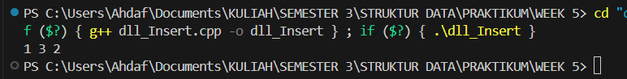
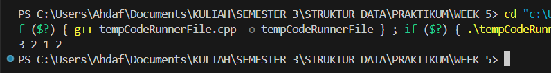
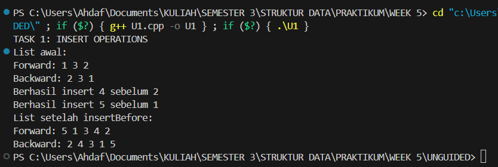
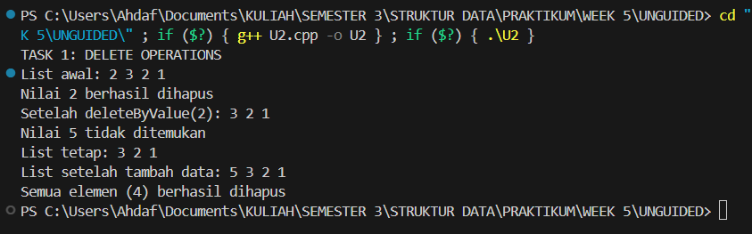
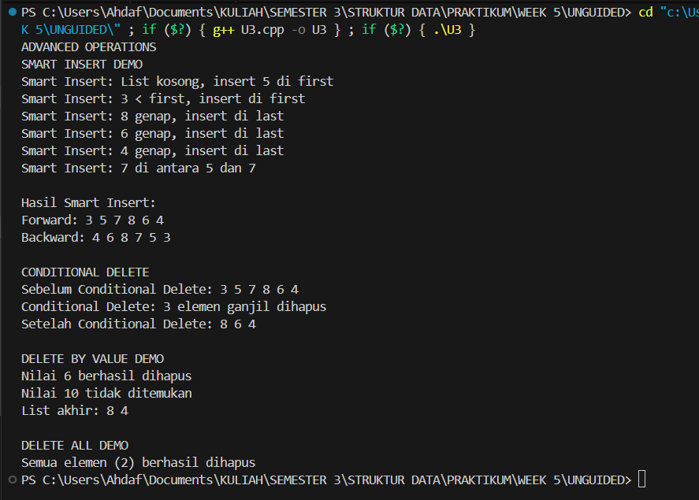

# Praktikum Struktur Data
## 1. Nama, NIM, Kelas
- **Nama**: Rahmat Ahdaf Albariza
- **NIM**: 103112430003
- **Kelas**: S1IF - 12 - 05 

## 2. Motivasi Belajar Struktur Data
Saya termotivasi mempelajari struktur data karena mata kuliah ini membantu saya memahami cara menyimpan dan mengolah data dengan lebih efisien. Pengetahuan ini penting, tidak hanya untuk menyelesaikan tugas kuliah, tetapi juga untuk membangun aplikasi atau sistem yang berguna di dunia nyata.

## 3. Dasar Teori
**Struktur data** adalah cara untuk menyimpan, mengatur, dan mengelola data di dalam komputer agar dapat digunakan secara efisien. Struktur data berperan penting dalam pemrosesan informasi dan menjadi dasar dari banyak algoritma. Berikut adalah beberapa teori dasar mengenai struktur data:
- **Array**: Struktur data yang menyimpan elemen dengan tipe data sama dalam urutan tertentu dan diakses menggunakan indeks.
- **Linked List**: Kumpulan simpul (node) yang saling terhubung melalui pointer, di mana setiap simpul berisi data dan alamat simpul berikutnya.
- **Stack**: Struktur data dengan prinsip _Last In First Out (LIFO)_, di mana elemen yang terakhir dimasukkan akan dikeluarkan terlebih dahulu.
- **Queue**: Struktur data dengan prinsip _First In First Out (FIFO)_, di mana elemen yang pertama dimasukkan akan dikeluarkan terlebih dahulu.
- **Graf**: Struktur data yang digunakan untuk menggambarkan hubungan antar objek yang disebut simpul (vertex) dan hubungan antar simpul yang disebut busur (edge).
- **Pohon (Tree)**: Struktur data hierarkis yang terdiri dari simpul dan tepi, dengan satu simpul sebagai akar (root) dan simpul lainnya sebagai anak.

## 4. Guided
### 4.1 Guided 1
```cpp
#include <iostream>

#define Nil NULL

using namespace std;

  

typedef int infotype;

typedef struct elmlist *address;

  
  

struct elmlist{

    infotype info;

    address next;

    address prev;

};

  
  

struct List {

    address first;

    address last;

};

  
  

void insertFirst(List &L, address P) {

    P->next = L.first;

    P->prev = Nil;

    if (L.first != Nil) L.first->prev = P;

    else L.last = P ;

    L.first = P;

}

  
  

void insertLast(List &L, address P) {

    P->prev = L.last;

    P->next = Nil;

    if (L.last != Nil) L.last -> next = P;

    else L.first = P;

    L.last = P;

}

  
  

void insertAfter (List &L, address P, address R) {

    P->next = R->next;

    P->prev = R;

    if (R->next != Nil) R->next->prev = P;

    else L.last = P;

    R->next = P;

}

  
  

address alokasi(infotype x) {

    address P = new elmlist;

    P->info = x;

    P->next = Nil;

    P->prev = Nil;

    return P;

}

  
  

void printInfo(List L) {

    address P = L.first;

    while (P != Nil) {

        cout << P->info << " ";

        P = P-> next ;

    }

    cout << endl;

}

  
  

int main(){

    List L;

    L.first = Nil;

    L.last = Nil;

    address P1 = alokasi(1);

    insertFirst(L, P1);

    address P2 = alokasi(2);

    insertLast(L, P2);

    address P3 = alokasi(3);

    insertAfter(L, P3, P1);

    printInfo(L);

    return 0;

}
```
Output :
>

Penjelasan : 
Program ini bikin dan nunjukin cara kerja **Doubly Linked List (DLL)**, yaitu struktur data yang tiap elemennya punya dua penunjuk: satu ke elemen setelahnya dan satu lagi ke elemen sebelumnya. Struktur `elmlist` nyimpen data (`info`) dan dua pointer (`next` dan `prev`), sedangkan `List` dipakai buat nyimpen alamat elemen pertama dan terakhir dari daftar. Ada beberapa fungsi penting, kayak `insertFirst` buat nambah data di awal, `insertLast` buat nambah di akhir, `insertAfter` buat nyisipin data setelah elemen tertentu, dan `printInfo` buat nampilin semua isi list. Di fungsi `main`, program mulai dari list kosong, terus nambah angka 1 di depan, angka 2 di belakang, dan angka 3 setelah angka 1. Hasil akhirnya yang keluar di layar adalah **1 3 2**.
### 4.2 Guided 2
```cpp
#include <iostream>

using namespace std;

#define Nil NULL

  

typedef int infotype;

typedef struct elmlist *address;

  

struct elmlist {

    infotype info;

    address next;

    address prev;

};

  

struct List {

    address first;

    address last;

};

  

address alokasi(infotype x) {

    address P = new elmlist;

    P->info = x ; P->next = Nil; P->prev = Nil; return P;

}

void dealokasi(address &P) {delete P; P = Nil;}

void insertFirst(List &L, address P) {

    P->next = L.first; P->prev = Nil;

    if (L.first != Nil) L.first->prev = P; else L.last = P;

    L.first = P;

}

  

void printInfo(List L) {

    address P = L.first; while (P != Nil) {cout << P->info << " "; P = P-> next;} cout;

}

void deleteFirst(List &L, address &P) {

    P = L.first; L.first = L.first->next;

    if (L.first != Nil) L.first->prev = Nil; else L.last = Nil;

    P->next = Nil; P->prev = Nil;

}

  

void deleteLast (List &L, address &P) {

    P = L.last; L.last = L.last->prev;

    if (L.last != Nil) L.last->next = Nil; else L.first = Nil;

    P->prev = Nil; P->next = Nil;

}

  

void deleteAfter (List &L, address &P, address R) {

    P = R->next; R->next = P->next;

    if (P->next != Nil) P->next->prev = R; else L.last = R;

    P->prev = Nil; P->next = Nil;

}

  

int main() {

    List L; L.first = Nil; L.last = Nil;

    insertFirst(L, alokasi (1)); insertFirst(L, alokasi(2)); insertFirst (L, alokasi(3));

    printInfo(L);

    address P; deleteFirst(L, P); dealokasi (P);

    deleteAfter (L, P, L.first); dealokasi (P);

    printInfo(L);

    return 0;

}
```
Output : 
>

Penjelasan : 
Program ini nunjukin cara kerja **Doubly Linked List (DLL)** yang bisa nambah dan hapus elemen dari daftar. Tiap node (`elmlist`) punya tiga bagian: `info` buat nyimpen data, lalu `next` dan `prev` buat nyambung ke elemen setelah dan sebelumnya. Struktur `List` dipakai buat nyimpen alamat elemen pertama (`first`) dan terakhir (`last`). Fungsi `alokasi` bikin node baru, sementara `dealokasi` ngapus node biar memori gak bocor. `insertFirst` dipakai buat nambah data di depan list, dan `printInfo` buat nampilin semua isinya dari awal sampai akhir. Ada juga tiga fungsi hapus: `deleteFirst` buat hapus elemen pertama, `deleteLast` buat hapus yang terakhir, dan `deleteAfter` buat hapus elemen setelah node tertentu. Di bagian `main`, program mulai dari list kosong, terus nambah tiga elemen (3, 2, 1) di depan — jadi urutannya **3 2 1**. Abis itu, elemen pertama (3) dihapus, lalu elemen setelah node pertama (yaitu 1) juga dihapus. Hasil akhirnya yang tampil di layar tinggal **2**.


## 5. Unguided
### 5.1 Unguided 1
```cpp
#include <iostream>

#define Nil NULL

using namespace std;

  

typedef int infotype;

typedef struct elmlist *address;

  
  

struct elmlist{

    infotype info;

    address next;

    address prev;

};

  
  

struct List {

    address first;

    address last;

};

  
  

void insertFirst(List &L, address P) {

    P->next = L.first;

    P->prev = Nil;

    if (L.first != Nil) L.first->prev = P;

    else L.last = P ;

    L.first = P;

}

  
  

void insertLast(List &L, address P) {

    P->prev = L.last;

    P->next = Nil;

    if (L.last != Nil) L.last -> next = P;

    else L.first = P;

    L.last = P;

}

  
  

void insertAfter (List &L, address P, address R) {

    P->next = R->next;

    P->prev = R;

    if (R->next != Nil) R->next->prev = P;

    else L.last = P;

    R->next = P;

}

  
  

address alokasi(infotype x) {

    address P = new elmlist;

    P->info = x;

    P->next = Nil;

    P->prev = Nil;

    return P;

}

  
  

void printInfo(List L) {

    address P = L.first;

    while (P != Nil) {

        cout << P->info << " ";

        P = P-> next ;

    }

    cout << endl;

}

  

void insertBefore(List &L, address P, address R) {

    P->next = R;

    P->prev = R->prev;

    if (R->prev != Nil)

        R->prev->next = P;

    else

        L.first = P;

    R->prev = P;

}

  

void printReverse(List L) {

    address P = L.last;

    while (P != Nil) {

        cout << P->info << " ";

        P = P->prev;

    }

    cout << endl;

}

  
  

int main() {

    List L;

    L.first = Nil;

    L.last = Nil;

  

    cout << "TASK 1: INSERT OPERATIONS" << endl;

  

    // Membuat list awal: 1 3 2

    address P1 = alokasi(1);

    insertFirst(L, P1);

    address P2 = alokasi(2);

    insertLast(L, P2);

    address P3 = alokasi(3);

    insertAfter(L, P3, P1);

  

    cout << "List awal:" << endl;

    cout << "Forward: ";

    printInfo(L);

    cout << "Backward: ";

    printReverse(L);

  

    // InsertBefore: 4 sebelum 2

    address P4 = alokasi(4);

    insertBefore(L, P4, P2);

    cout << "Berhasil insert 4 sebelum 2" << endl;

  

    // InsertBefore: 5 sebelum 1

    address P5 = alokasi(5);

    insertBefore(L, P5, P1);

    cout << "Berhasil insert 5 sebelum 1" << endl;

  

    cout << "List setelah insertBefore:" << endl;

    cout << "Forward: ";

    printInfo(L);

    cout << "Backward: ";

    printReverse(L);

  

    return 0;

}
```
Output : 
>

Penjelasan : 
Program ini dibuat untuk mengelola **Double Linked List (DLL)**, yaitu struktur data yang tiap elemennya punya dua arah: satu nunjuk ke elemen setelahnya (`next`) dan satu lagi ke elemen sebelumnya (`prev`). Karena dua arah ini, list bisa dibaca dari depan ke belakang atau sebaliknya. Di program ini, kita juga bisa nambah elemen baru di posisi mana aja — bisa di awal, di akhir, setelah elemen tertentu, atau sebelum elemen tertentu.

Fokus utama program ini ada di dua fungsi tambahan: `insertBefore` dan `printReverse`. Fungsi `insertBefore` dipakai buat nyisipin data baru di depan elemen tertentu, dengan ngatur ulang pointer biar tetep nyambung dua arah. Sedangkan `printReverse` dipakai buat nampilin isi list tapi dari belakang ke depan, mulai dari elemen paling akhir (`last`).

Di bagian `main`, program awalnya bikin list berisi angka 1, 3, dan 2. Terus, elemen 4 dimasukin sebelum angka 2, dan elemen 5 dimasukin sebelum angka 1. Hasil akhirnya ditampilin dua kali — sekali dari depan dan sekali dari belakang — buat nunjukin kalau proses insert-nya berhasil dan hubungan antar node-nya udah benar.
### 5.2 Unguided 2
```cpp
#include <iostream>

using namespace std;

#define Nil NULL

  

typedef int infotype;

typedef struct elmlist *address;

  

struct elmlist {

    infotype info;

    address next;

    address prev;

};

  

struct List {

    address first;

    address last;

};

  

address alokasi(infotype x) {

    address P = new elmlist;

    P->info = x;

    P->next = Nil;

    P->prev = Nil;

    return P;

}

  

void dealokasi(address &P) {

    delete P;

    P = Nil;

}

  

void insertFirst(List &L, address P) {

    P->next = L.first;

    P->prev = Nil;

    if (L.first != Nil)

        L.first->prev = P;

    else

        L.last = P;

    L.first = P;

}

  

void printInfo(List L) {

    address P = L.first;

    while (P != Nil) {

        cout << P->info << " ";

        P = P->next;

    }

    cout << endl;

}

  

void deleteFirst(List &L, address &P) {

    P = L.first; L.first = L.first->next;

    if (L.first != Nil) L.first->prev = Nil; else L.last = Nil;

    P->next = Nil; P->prev = Nil;

}

  

void deleteLast (List &L, address &P) {

    P = L.last; L.last = L.last->prev;

    if (L.last != Nil) L.last->next = Nil; else L.first = Nil;

    P->prev = Nil; P->next = Nil;

}

  

void deleteAfter (List &L, address &P, address R) {

    P = R->next; R->next = P->next;

    if (P->next != Nil) P->next->prev = R; else L.last = R;

    P->prev = Nil; P->next = Nil;

}

  

bool deleteByValue(List &L, infotype x) {

    address P = L.first;

  

    while (P != Nil && P->info != x) {

        P = P->next;

    }

  

    if (P == Nil) {

        cout << "Nilai " << x << " tidak ditemukan" << endl;

        return false;

    }

  

    if (P == L.first) {

        L.first = P->next;

        if (L.first != Nil)

            L.first->prev = Nil;

        else

            L.last = Nil;

    } else if (P == L.last) {

        L.last = P->prev;

        if (L.last != Nil)

            L.last->next = Nil;

        else

            L.first = Nil;

    } else {

        P->prev->next = P->next;

        P->next->prev = P->prev;

    }

  

    cout << "Nilai " << x << " berhasil dihapus" << endl;

    dealokasi(P);

    return true;

}

  

void deleteAll(List &L) {

    address P = L.first;

    int count = 0;

    while (P != Nil) {

        address temp = P;

        P = P->next;

        dealokasi(temp);

        count++;

    }

    L.first = Nil;

    L.last = Nil;

    cout << "Semua elemen (" << count << ") berhasil dihapus" << endl;

}

  

int main() {

    List L;

    L.first = Nil;

    L.last = Nil;

  

    cout << "TASK 1: DELETE OPERATIONS" << endl;

  

    // List awal: 2 3 2 1

    insertFirst(L, alokasi(1));

    insertFirst(L, alokasi(2));

    insertFirst(L, alokasi(3));

    insertFirst(L, alokasi(2));

  

    cout << "List awal: ";

    printInfo(L);

  

    // Delete by value 2

    deleteByValue(L, 2);

    cout << "Setelah deleteByValue(2): ";

    printInfo(L);

  

    // Delete value yang tidak ada

    deleteByValue(L, 5);

    cout << "List tetap: ";

    printInfo(L);

  

    // Tambah data baru

    insertFirst(L, alokasi(5));

    cout << "List setelah tambah data: ";

    printInfo(L);

  

    // Delete semua elemen

    deleteAll(L);

  

    return 0;

}
```
Output : 
>

Penjelasan : 
Program ini merupakan implementasi **Double Linked List (DLL)** di C++, di mana setiap elemen (node) punya dua pointer: satu mengarah ke elemen setelahnya (`next`) dan satu lagi ke elemen sebelumnya (`prev`). Program ini berfokus pada operasi **penghapusan data** di dalam list, mulai dari menghapus elemen pertama (`deleteFirst`), elemen terakhir (`deleteLast`), elemen setelah node tertentu (`deleteAfter`), sampai menghapus elemen berdasarkan nilai tertentu (`deleteByValue`) atau bahkan menghapus semua elemen sekaligus (`deleteAll`).

Di fungsi `main`, program awalnya bikin list dengan isi **2, 3, 2, 1** (urutan dari depan ke belakang). Setelah itu, dilakukan penghapusan nilai **2** pertama yang ditemukan di list pakai `deleteByValue`, lalu ditampilkan hasilnya. Kalau data yang dicari nggak ada (misalnya angka 5), program bakal ngasih pesan kalau nilai tersebut nggak ditemukan. Setelah itu, elemen baru dengan nilai **5** ditambahkan di depan list untuk nunjukin bahwa operasi tambah dan hapus bisa dilakukan bergantian tanpa gangguan. Di akhir, semua elemen dihapus dengan `deleteAll`, dan program ngasih tahu berapa banyak elemen yang berhasil dihapus. Program ini bisa dibilang contoh lengkap buat belajar cara ngatur memori dan pointer di struktur data **double linked list** secara aman dan efisien.

### 5.3 Unguided 3
```cpp
#include <iostream>

using namespace std;

#define Nil NULL

  

typedef int infotype;

typedef struct elmlist *address;

  

struct elmlist {

    infotype info;

    address next;

    address prev;

};

  

struct List {

    address first;

    address last;

};

  

address alokasi(infotype x) {

    address P = new elmlist;

    P->info = x;

    P->next = Nil;

    P->prev = Nil;

    return P;

}

  

void dealokasi(address &P) {

    delete P;

    P = Nil;

}

  

void insertFirst(List &L, address P) {

    P->next = L.first;

    P->prev = Nil;

    if (L.first != Nil)

        L.first->prev = P;

    else

        L.last = P;

    L.first = P;

}

  

void insertLast(List &L, address P) {

    P->prev = L.last;

    P->next = Nil;

    if (L.last != Nil)

        L.last->next = P;

    else

        L.first = P;

    L.last = P;

}

  

void insertAfter(List &L, address P, address R) {

    P->next = R->next;

    P->prev = R;

    if (R->next != Nil)

        R->next->prev = P;

    else

        L.last = P;

    R->next = P;

}

  

void printForward(List L) {

    address P = L.first;

    while (P != Nil) {

        cout << P->info << " ";

        P = P->next;

    }

    cout << endl;

}

  

void printBackward(List L) {

    address P = L.last;

    while (P != Nil) {

        cout << P->info << " ";

        P = P->prev;

    }

    cout << endl;

}

  

// SMART INSERT

void smartInsert(List &L, infotype x) {

    address P = alokasi(x);

    cout << "Smart Insert: ";

  

    // 1) List kosong

    if (L.first == Nil) {

        insertFirst(L, P);

        cout << "List kosong, insert " << x << " di first" << endl;

        return;

    }

  

    // 2) Nilai lebih kecil dari elemen pertama

    if (x < L.first->info) {

        insertFirst(L, P);

        cout << x << " < first, insert di first" << endl;

        return;

    }

  

    // 3) Nilai genap

    if (x % 2 == 0) {

        insertLast(L, P);

        cout << x << " genap, insert di last" << endl;

        return;

    }

  

    // 4) Nilai ganjil (di antara dua nilai)

    address Q = L.first;

    bool inserted = false;

    while (Q->next != Nil) {

        if (Q->info < x && x < Q->next->info) {

            insertAfter(L, P, Q);

            cout << x << " di antara " << Q->info << " dan " << Q->next->info << endl;

            inserted = true;

            break;

        }

        Q = Q->next;

    }

  

    // Jika tidak menemukan posisi di tengah

    if (!inserted) {

        insertLast(L, P);

        cout << x << " insert di last (tidak menemukan posisi tengah)" << endl;

    }

}

  

// CONDITIONAL DELETE (hapus semua bilangan ganjil)

void conditionalDelete(List &L) {

    cout << "Sebelum Conditional Delete: ";

    printForward(L);

  

    address P = L.first;

    int count = 0;

  

    while (P != Nil) {

        address next = P->next;

        if (P->info % 2 != 0) { // hapus ganjil

            if (P == L.first) {

                L.first = P->next;

                if (L.first != Nil) L.first->prev = Nil;

                else L.last = Nil;

            } else if (P == L.last) {

                L.last = P->prev;

                if (L.last != Nil) L.last->next = Nil;

                else L.first = Nil;

            } else {

                P->prev->next = P->next;

                P->next->prev = P->prev;

            }

            dealokasi(P);

            count++;

        }

        P = next;

    }

  

    cout << "Conditional Delete: " << count << " elemen ganjil dihapus" << endl;

    cout << "Setelah Conditional Delete: ";

    printForward(L);

}

  

// MAIN PROGRAM

int main() {

    List L;

    L.first = Nil;

    L.last = Nil;

  

    cout << "ADVANCED OPERATIONS" << endl;

    cout << "SMART INSERT DEMO" << endl;

  

    smartInsert(L, 5);

    smartInsert(L, 3);

    smartInsert(L, 8);

    smartInsert(L, 6);

    smartInsert(L, 4);

    smartInsert(L, 7);

  

    cout << "\nHasil Smart Insert:" << endl;

    cout << "Forward: ";

    printForward(L);

    cout << "Backward: ";

    printBackward(L);

    cout << endl;

  

    cout << "CONDITIONAL DELETE" << endl;

    conditionalDelete(L);

    cout << endl;

  

    cout << "DELETE BY VALUE DEMO" << endl;

    // hapus nilai 6

    int x = 6;

    address P = L.first;

    while (P != Nil && P->info != x) P = P->next;

    if (P != Nil) {

        if (P == L.first) {

            L.first = P->next;

            if (L.first != Nil) L.first->prev = Nil;

        } else if (P == L.last) {

            L.last = P->prev;

            if (L.last != Nil) L.last->next = Nil;

        } else {

            P->prev->next = P->next;

            P->next->prev = P->prev;

        }

        cout << "Nilai " << x << " berhasil dihapus" << endl;

        dealokasi(P);

    } else {

        cout << "Nilai " << x << " tidak ditemukan" << endl;

    }

  

    // hapus nilai 10

    x = 10;

    P = L.first;

    while (P != Nil && P->info != x) P = P->next;

    if (P != Nil) {

        if (P == L.first) {

            L.first = P->next;

            if (L.first != Nil) L.first->prev = Nil;

        } else if (P == L.last) {

            L.last = P->prev;

            if (L.last != Nil) L.last->next = Nil;

        } else {

            P->prev->next = P->next;

            P->next->prev = P->prev;

        }

        cout << "Nilai " << x << " berhasil dihapus" << endl;

        dealokasi(P);

    } else {

        cout << "Nilai " << x << " tidak ditemukan" << endl;

    }

  

    cout << "List akhir: ";

    printForward(L);

    cout << endl;

  

    cout << "DELETE ALL DEMO" << endl;

    int count = 0;

    while (L.first != Nil) {

        address temp = L.first;

        L.first = L.first->next;

        dealokasi(temp);

        count++;

    }

    L.last = Nil;

    cout << "Semua elemen (" << count << ") berhasil dihapus" << endl;

  

    return 0;

}
```
Output : 
>

Penjelasan : 
Program ini adalah versi lanjutan dari **double linked list** yang bisa nambah dan hapus data dengan aturan tertentu. Di dalamnya ada dua fungsi utama: `smartInsert()` dan `conditionalDelete()`.

Struktur datanya pakai `struct elmlist` buat nyimpen nilai dan dua pointer (`next` dan `prev`), lalu `struct List` buat nyimpen posisi awal (`first`) dan akhir (`last`). Ada juga fungsi dasar seperti `insertFirst()`, `insertLast()`, dan `insertAfter()` buat nambah elemen di depan, belakang, atau setelah elemen tertentu. Fungsi `alokasi()` dipakai buat bikin node baru, dan `dealokasi()` buat hapus node dari memori.

Fungsi **`smartInsert()`** dipakai buat nyisipin elemen baru sesuai kondisi. Kalau list masih kosong, elemennya langsung dimasukin di depan. Kalau nilainya lebih kecil dari elemen pertama, juga dimasukin di depan. Kalau angkanya genap, ditaruh di belakang. Tapi kalau ganjil, program bakal nyari posisi yang pas di antara dua angka yang ada. Kalau gak ketemu posisi di tengah, elemen itu dimasukin di akhir. Setiap langkahnya akan muncul pesan supaya kita tahu prosesnya.

Fungsi **`conditionalDelete()`** tugasnya ngapus elemen dengan kondisi tertentu, yaitu semua angka ganjil. Program bakal ngecek satu-satu isi list, hapus angka ganjil, terus ngitung berapa banyak yang dihapus. Setelah selesai, hasil list baru ditampilin lagi.

Di bagian `main()`, semua fungsi ini dicoba satu per satu. Pertama `smartInsert()` buat nambah beberapa angka sampai list-nya jadi **3 5 7 8 6 4**. Lalu `conditionalDelete()` dijalanin buat hapus angka ganjil, jadi sisa **8 6 4**. Setelah itu, program coba hapus angka tertentu — angka 6 berhasil dihapus, sedangkan angka 10 gak ada di list. Terakhir, semua elemen dihapus sampai list kosong.

Singkatnya, program ini nunjukin cara kerja double linked list yang bisa nambah dan hapus data dengan aturan tertentu, sambil nunjukin pesan supaya kita tahu setiap langkah yang dilakukan.
## 6. Kesimpulan
Dari praktikum ini bisa disimpulkan bahwa **Double Linked List (DLL)** adalah salah satu struktur data yang fleksibel karena setiap elemen (node) terhubung dua arah — ke depan dan ke belakang. Dengan dua pointer ini, proses penambahan dan penghapusan data bisa dilakukan lebih mudah tanpa harus menggeser seluruh elemen seperti pada array.  
Fungsi-fungsi dasar seperti `insertFirst`, `insertLast`, dan `insertAfter` membantu menambah data di berbagai posisi, sedangkan `deleteFirst`, `deleteLast`, dan `deleteAfter` dipakai untuk menghapus elemen dengan aman.  
Fitur tambahan seperti `smartInsert()` dan `conditionalDelete()` juga memperlihatkan bagaimana logika kondisi bisa diterapkan di struktur data untuk membuat program jadi lebih “cerdas”. Secara keseluruhan, praktikum ini membantu memahami cara kerja pointer, hubungan antar node, serta pengelolaan memori secara dinamis di dalam linked list.

## 7. Referensi
https://www.w3schools.com/cpp/default.asp
https://www.geeksforgeeks.org/doubly-linked-list
https://www.programiz.com/dsa/doubly-linked-list
https://www.studytonight.com/data-structures/doubly-linked-list