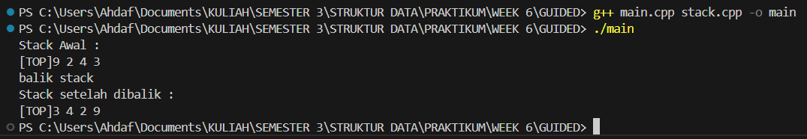
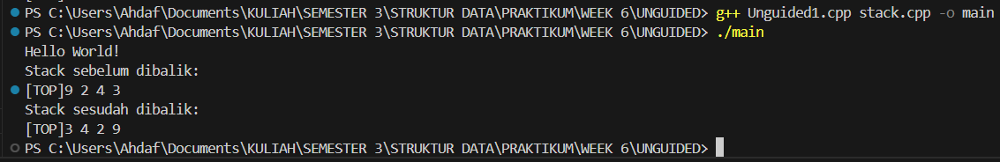
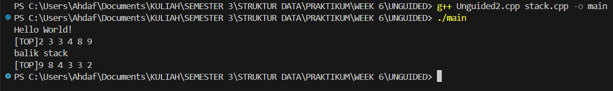
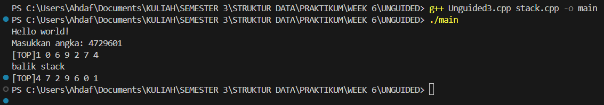

# Praktikum Struktur Data
---
## 1. Nama, NIM, Kelas
---
- **Nama**: Rahmat Ahdaf Albariza
- **NIM**: 103112430003
- **Kelas**: S1IF - 12 - 05 

## 2. Motivasi Belajar Struktur Data
---
Saya termotivasi mempelajari struktur data karena mata kuliah ini membantu saya memahami cara menyimpan dan mengolah data dengan lebih efisien. Pengetahuan ini penting, tidak hanya untuk menyelesaikan tugas kuliah, tetapi juga untuk membangun aplikasi atau sistem yang berguna di dunia nyata.

## 3. Dasar Teori
---
**Struktur data** adalah cara untuk menyimpan, mengatur, dan mengelola data di dalam komputer agar dapat digunakan secara efisien. Struktur data berperan penting dalam pemrosesan informasi dan menjadi dasar dari banyak algoritma. Berikut adalah beberapa teori dasar mengenai struktur data:
- **Array**: Struktur data yang menyimpan elemen dengan tipe data sama dalam urutan tertentu dan diakses menggunakan indeks.
- **Linked List**: Kumpulan simpul (node) yang saling terhubung melalui pointer, di mana setiap simpul berisi data dan alamat simpul berikutnya.
- **Stack**: Struktur data dengan prinsip _Last In First Out (LIFO)_, di mana elemen yang terakhir dimasukkan akan dikeluarkan terlebih dahulu.
- **Queue**: Struktur data dengan prinsip _First In First Out (FIFO)_, di mana elemen yang pertama dimasukkan akan dikeluarkan terlebih dahulu.
- **Graf**: Struktur data yang digunakan untuk menggambarkan hubungan antar objek yang disebut simpul (vertex) dan hubungan antar simpul yang disebut busur (edge).
- **Pohon (Tree)**: Struktur data hierarkis yang terdiri dari simpul dan tepi, dengan satu simpul sebagai akar (root) dan simpul lainnya sebagai anak.

## 4. Guided
---
### 4.1 Guided 1
```cpp
#ifndef STACK_H
#define STACK_H

#include <iostream>
#define MaxEl 20
#define Nil -1

typedef int infotype;

struct Stack{
    infotype info[MaxEl]; //array untuk menyimpan elemen stack
    int top;
};

void CreateStack(Stack &S);
bool isEmpty(Stack S);
bool isFull(Stack S);
void push(Stack &S, infotype x); // Menambahkan elemen ke dalam stack
infotype pop(Stack &S); // Mengambil elemen teratas dari stack
void printInfo(Stack S);
void balikStack(Stack &S); // Membalik urutan elemen dalam stack

#endif
```
Penjelasan : 
**`stack.h`** ini berfungsi sebagai **header file** yang ngasih tahu struktur data dan daftar fungsi yang dipakai buat ngatur **stack (tumpukan)**. Di bagian awal ada **header guard** (`#ifndef STACK_H`, `#define STACK_H`, `#endif`) yang gunanya biar file ini nggak ke-include dua kali dan bikin error. Terus ada `#include <iostream>` buat manggil library input-output standar C++, lalu `#define MaxEl 20` yang nunjukin kapasitas maksimum stack (20 elemen), dan `#define Nil -1` yang jadi tanda kalau stack masih kosong. Di bawahnya ada `typedef int infotype;` yang intinya bikin alias tipe data — jadi kalau nanti mau ganti tipe data yang disimpan di stack (misalnya dari `int` ke `float` atau `string`), tinggal ubah satu baris ini aja.

Struktur utama stack-nya didefinisikan lewat `struct Stack`, isinya ada `infotype info[MaxEl]` buat nyimpen data, dan `int top` buat nandain posisi elemen paling atas. Kalau `top = -1`, berarti stack kosong, dan kalau `top = MaxEl - 1`, berarti stack penuh. Di bagian akhir ada daftar fungsi yang bakal dipakai buat ngoperasikan stack: `CreateStack` buat inisialisasi, `isEmpty` dan `isFull` buat ngecek kondisi stack, `push` buat nambah elemen baru ke atas, `pop` buat ngambil elemen paling atas, `printInfo` buat nampilin isi stack, dan `balikStack` buat ngebalik urutan elemen di dalamnya. Semua fungsi ini baru dideklarasikan di file ini, sementara cara kerjanya bakal dijelasin di file lain, biasanya `stack.cpp`. Jadi singkatnya, file `stack.h` ini kayak **blueprint** atau rancangan umum yang ngasih tahu apa aja isi dan fungsi-fungsi yang dimiliki oleh modul stack tanpa nunjukin detail kodenya.
### 4.2 Guided 2
```cpp
#include "stack.h" // mengimpor header file stack.h yang berisi definisi struktur dan konstanta

using namespace std;


void CreateStack(Stack &S){
    S.top = Nil;
}

// FUngsi untuk mengecek apakah stack kosong
bool isEmpty(Stack S){
    return S.top == Nil; // mengembalikan true jika top bernilai Nil, false jika tidak
}

// Fungsi untuk mengecek apakah stack penuh
bool isFull(Stack S){
    return S.top == MaxEl - 1;
}


void push(Stack &S, infotype x){
    if (!isFull(S)){
        S.top++;
        S.info[S.top] = x;
    }else{
        cout << "Stack Penuh!" << endl;
    }
}

// Fungsi untuk mengambil elemen teratas daristack (pop)
infotype pop(Stack &S){
    infotype x = -999;
    if (!isEmpty(S)){
        x = S.info[S.top];
        S.top--;
    } else{
        cout << "Stack Kosong!" << endl;
    }
    return x;
}

// FUngsi untuk menampilkan isi stack
void printInfo(Stack S) {
    if (isEmpty(S)) {
        cout << "Stack Kosong" << endl;
    } else {
        cout << "[TOP]";
        for (int i = S.top; i >= 0; i--) {
            cout << S.info[i] << " ";
        }
        cout << endl;
    }
}

// Fungsi untuk membalik urutan elemen dalam stack
void balikStack(Stack &S) {
    if (!isEmpty(S)) { // Cek apakah stack tidak kosong
        Stack temp1, temp2; // Deklarasi dua stack temporary
        CreateStack(temp1); CreateStack(temp2);

        while (!isEmpty(S)) { push(temp1, pop(S)); }

        while (!isEmpty(temp1)) { push(temp2, pop(temp1)); }

        while (!isEmpty(temp2)) { push(S, pop(temp2)); }
    }
}
```
Penjelasan : 
Kode di atas adalah isi dari file **`stack.cpp`**, yaitu tempat semua fungsi dari **`stack.h`** dijalankan atau diisi logikanya. Di awal ada `#include "stack.h"` buat manggil definisi stack dan konstanta yang udah dibuat di header, terus ada `using namespace std;` biar bisa langsung pakai `cout` tanpa nulis `std::`. Fungsi `CreateStack(Stack &S)` dipakai buat **nginisialisasi stack baru**, caranya dengan ngasih nilai `S.top = Nil`, yang artinya stack masih kosong. Lalu ada `isEmpty(Stack S)` yang ngecek apakah stack kosong (balik `true` kalau `top == Nil`), dan `isFull(Stack S)` buat ngecek apakah stack udah penuh (`top == MaxEl - 1`). Fungsi `push(Stack &S, infotype x)` dipakai buat **nambah data ke atas stack**. Kalau stack belum penuh, `top` dinaikkin satu dan data `x` dimasukin ke posisi paling atas. Tapi kalau udah penuh, bakal muncul pesan “Stack Penuh!”.

Fungsi `pop(Stack &S)` kebalikannya, yaitu buat **ngambil dan ngapus data paling atas**. Kalau stack nggak kosong, data teratas disimpen dulu ke variabel `x`, terus `top` dikurangin satu. Tapi kalau kosong, tampil pesan “Stack Kosong!” dan `x` dikasih nilai `-999` sebagai tanda error. Lalu `printInfo(Stack S)` berfungsi buat **nampilin isi stack** di layar. Kalau kosong, bakal muncul tulisan “Stack Kosong”, tapi kalau ada isinya, program bakal nampilin dari elemen paling atas sampai paling bawah. Terakhir ada `balikStack(Stack &S)` yang fungsinya buat **ngebalik urutan isi stack**. Caranya pakai dua stack sementara (`temp1` dan `temp2`), jadi elemen dari `S` dipindahin ke `temp1`, lalu ke `temp2`, dan akhirnya dimasukin lagi ke `S` biar urutannya kebalik. Intinya, file ini ngatur semua operasi dasar stack kayak push, pop, print, dan balik data dengan konsep **LIFO (Last In, First Out)** — data terakhir yang masuk bakal jadi yang pertama keluar.
### 4.3 Guided 3
```cpp
#include "stack.h"
#include <iostream>

using namespace std;

int main(){
    Stack S;
    CreateStack(S);

    push(S, 3);
    push(S, 4);
    push(S, 8);
    pop(S);
    push(S, 2);
    push(S, 3);
    pop(S);
    push(S, 9);

    cout << "Stack Awal : " << endl;
    printInfo(S);

    cout << "balik stack" << endl;
    balikStack(S);

    cout << "Stack setelah dibalik : " << endl;
    printInfo(S);

    return 0;
}
```
Output : 
>

Penjelasan : 
Kode di atas adalah **program utama (`main.cpp`)** yang nunjukin gimana cara pakai fungsi-fungsi dari modul **stack** yang udah dibuat sebelumnya di `stack.h` dan `stack.cpp`. Baris `#include "stack.h"` berfungsi buat **manggil semua definisi struktur dan fungsi stack**, sedangkan `#include <iostream>` dan `using namespace std;` dipakai biar bisa pakai perintah `cout` buat nampilin output ke layar tanpa perlu nulis `std::`.

Di dalam fungsi `main()`, pertama dibuat sebuah variabel stack bernama `S` dengan tipe `Stack`. Lalu dipanggil `CreateStack(S)` buat **nginisialisasi stack** supaya `top`-nya diset ke `Nil`, alias masih kosong. Setelah itu, dilakukan beberapa operasi **push** dan **pop** untuk ngatur isi stack. `push(S, 3)`, `push(S, 4)`, dan `push(S, 8)` nambahin angka 3, 4, dan 8 ke dalam stack. Lalu `pop(S)` ngambil dan ngapus elemen paling atas (yaitu 8). Setelah itu `push(S, 2)` dan `push(S, 3)` nambahin lagi dua elemen baru, kemudian `pop(S)` ngapus elemen teratas (yaitu 3), dan terakhir `push(S, 9)` masukin angka 9 ke atas stack.

Setelah semua operasi itu, program nampilin isi stack lewat `cout << "Stack Awal :"` dan fungsi `printInfo(S)`, yang bakal nunjukin isi stack dari atas ke bawah. Kemudian ada perintah `balikStack(S)` buat **ngebalik urutan isi stack**, jadi elemen paling bawah jadi yang paling atas, dan sebaliknya. Setelah dibalik, program nampilin hasil akhirnya dengan `cout << "Stack setelah dibalik :"` dan `printInfo(S)` lagi.

## 5. Unguided
#### Sebelum masuk ke Unguided ada perubahan pada file stack.h dan stack.cpp
stack.h
```cpp
#ifndef STACK_H
#define STACK_H

#include <iostream>
#define MaxEl 20
#define Nil -1

typedef int infotype;

struct Stack{
    infotype info[MaxEl]; //array untuk menyimpan elemen stack
    int top;
};

void CreateStack(Stack &S);
bool isEmpty(Stack S);
bool isFull(Stack S);
void push(Stack &S, infotype x); // Menambahkan elemen ke dalam stack
infotype pop(Stack &S); // Mengambil elemen teratas dari stack
void printInfo(Stack S);
void balikStack(Stack &S); // Membalik urutan elemen dalam stack

// procedure tambahan
void pushAscending(Stack &S, infotype X);
void getInputStream(Stack &S);

#endif
```
Penjelasan :
Ada 2 tambahan procedure yaitu `void pushAscending` dan `void getInputStream`

stack.cpp
```cpp
#include "stack.h" // mengimpor header file stack.h yang berisi definisi struktur dan konstanta

using namespace std;


void CreateStack(Stack &S){
    S.top = Nil;
}

// FUngsi untuk mengecek apakah stack kosong
bool isEmpty(Stack S){
    return S.top == Nil; // mengembalikan true jika top bernilai Nil, false jika tidak
}

// Fungsi untuk mengecek apakah stack penuh
bool isFull(Stack S){
    return S.top == MaxEl - 1;
}


void push(Stack &S, infotype x){
    if (!isFull(S)){
        S.top++;
        S.info[S.top] = x;
    }else{
        cout << "Stack Penuh!" << endl;
    }
}

// Fungsi untuk mengambil elemen teratas daristack (pop)
infotype pop(Stack &S){
    infotype x = -999;
    if (!isEmpty(S)){
        x = S.info[S.top];
        S.top--;
    } else{
        cout << "Stack Kosong!" << endl;
    }
    return x;
}

// FUngsi untuk menampilkan isi stack
void printInfo(Stack S) {
    if (isEmpty(S)) {
        cout << "Stack Kosong" << endl;
    } else {
        cout << "[TOP]";
        for (int i = S.top; i >= 0; i--) {
            cout << S.info[i] << " ";
        }
        cout << endl;
    }
}

// Fungsi untuk membalik urutan elemen dalam stack
void balikStack(Stack &S) {
    if (!isEmpty(S)) { // Cek apakah stack tidak kosong
        Stack temp1, temp2; // Deklarasi dua stack temporary
        CreateStack(temp1); CreateStack(temp2);

        while (!isEmpty(S)) { push(temp1, pop(S)); }

        while (!isEmpty(temp1)) { push(temp2, pop(temp1)); }

        while (!isEmpty(temp2)) { push(S, pop(temp2)); }
    }
}

// Menambahkan elemen secara ascending
void pushAscending(Stack &S, infotype X) {
    if (isFull(S)) {
        cout << "Stack penuh" << endl;
        return;
    }

    Stack temp;
    CreateStack(temp);

    // Pindahkan elemen yang lebih kecil dari X ke stack sementara
    while (!isEmpty(S) && S.info[S.top] < X) {
        push(temp, pop(S));
    }

    // Push X ke stack utama
    push(S, X);

    // Kembalikan elemen dari stack sementara ke stack utama
    while (!isEmpty(temp)) {
        push(S, pop(temp));
    }
}

// Membaca input stream dari user dan masukkan ke stack
void getInputStream(Stack &S) {
    cout << "Masukkan angka: ";
    string input;
    cin >> input; // membaca seluruh string angka tanpa spasi (misal: 4729601)

    for (char c : input) {
        if (isdigit(c)) { // hanya karakter angka yang valid
            int value = c - '0';
            push(S, value);
        }
    }
}
```
Penjelasan : 
Ada 2 tambahan procedure yaitu `void pushAscending` dan `void getInputStream`
### 5.1 Unguided 1
```cpp
#include "stack.h"
#include <iostream>
using namespace std;

int main() {
    cout << "Hello World!" << endl;
    Stack S;
    CreateStack(S);

    // Operasi stack
    push(S, 3);
    push(S, 4);
    push(S, 8);
    pop(S);
    push(S, 2);
    push(S, 3);
    pop(S);
    push(S, 9);

    cout << "Stack sebelum dibalik:" << endl;
    printInfo(S);

    balikStack(S);

    cout << "Stack sesudah dibalik:" << endl;
    printInfo(S);

    return 0;
}
```
Output : 
>

Penjelasan : 
Program ini mirip Program `Guided3` cuman ada tambahan menampilkan pesan `Hello World!`

### 5.2 Unguided 2
```cpp
#include "stack.h"
#include <iostream>
using namespace std;

int main() {
    cout << "Hello World!" << endl;
    Stack S;
    CreateStack(S);
    pushAscending(S, 3);
    pushAscending(S, 4);
    pushAscending(S, 8);
    pushAscending(S, 2);
    pushAscending(S, 3);
    pushAscending(S, 9);
    printInfo(S);
    cout << "balik stack" << endl;
    balikStack(S);
    printInfo(S);
    return 0;
}
```
Output : 
>

Penjelasan : 
Program **Unguided2.cpp** ini jadi program utama yang dipakai buat ngetes dua fungsi penting di stack, yaitu **pushAscending** dan **balikStack**. Setelah ng-include `stack.h` dan `iostream`, program bikin satu stack bernama `S` terus diinisialisasi pakai `CreateStack(S)`. Abis itu, program nyobain fungsi **pushAscending** dengan masukin data 3, 4, 8, 2, 3, dan 9 satu per satu. Bedanya sama push biasa, fungsi ini bakal ngatur supaya data yang masuk tetap urut (biasanya dari kecil ke besar). Setelah semua data dimasukin, `printInfo(S)` dipanggil buat nampilin isi stack-nya. Terus program nampilin tulisan "balik stack", lalu manggil fungsi **balikStack(S)** buat ngebalik urutan elemen di stack. Hasil akhirnya ditampilin lagi pakai `printInfo(S)`. Jadi, lewat program ini, kita bisa lihat gimana stack bisa nyimpen data secara terurut dan juga dibalik urutannya.

### 5.3 Unguided 3
```cpp
#include "stack.h"
#include <iostream>
using namespace std;

int main() {
    cout << "Hello world!" << endl;
    Stack S;
    CreateStack(S);

    // gunakan fungsi getInputStream untuk membaca input angka dari user
    getInputStream(S);

    // tampilkan isi stack hasil input
    printInfo(S);

    cout << "balik stack" << endl;
    balikStack(S);

    // tampilkan hasil setelah dibalik
    printInfo(S);

    return 0;
}

```
Output : 
>

Penjelasan : 
Program di atas dipakai buat nunjukin cara kerja **stack** yang udah didefinisikan di file _stack.h_ dan _stack.cpp_. Pertama, program bikin satu variabel stack bernama `S`, lalu diinisialisasi biar kosong pakai `CreateStack(S)`. Setelah itu, program manggil `getInputStream(S)` buat baca angka yang diketik sama pengguna, misalnya “4729601”. Setiap digit yang dimasukin bakal disimpan satu per satu ke dalam stack, di mana angka terakhir yang dimasukin bakal ada di posisi paling atas (karena stack pakai sistem _Last In, First Out_). Begitu selesai, program nampilin isi stack dengan `printInfo(S)`, jadi kelihatan urutan angkanya dari atas ke bawah. Lalu program manggil `balikStack(S)` buat ngebalik isi stack, jadi yang tadinya di atas pindah ke bawah, dan sebaliknya. Terakhir, hasil setelah dibalik ditampilin lagi pakai `printInfo(S)` biar kelihatan perubahannya.
## 6. Kesimpulan
Dari seluruh percobaan yang dilakukan, dapat disimpulkan bahwa struktur data **Stack** bekerja dengan prinsip **LIFO (Last In First Out)**, di mana data terakhir yang masuk akan menjadi data pertama yang keluar. Melalui implementasi fungsi-fungsi seperti `push`, `pop`, `printInfo`, dan `balikStack`, kita bisa memahami cara kerja dasar stack dalam menambah, menghapus, menampilkan, dan membalik urutan data. Selain itu, penambahan fungsi **`pushAscending`** menunjukkan bahwa operasi stack bisa dimodifikasi agar elemen yang dimasukkan tetap tersusun rapi sesuai urutan tertentu, sedangkan fungsi **`getInputStream`** memperlihatkan bagaimana data bisa diinput secara interaktif dari pengguna. Secara keseluruhan, praktikum ini membantu memahami konsep dasar, manipulasi data, dan fleksibilitas penerapan stack dalam pemrograman.

## 7. Referensi
https://www.w3schools.com/cpp/default.asp
https://www.programiz.com/dsa/stack
https://cplusplus.com/reference/stack/stack/
