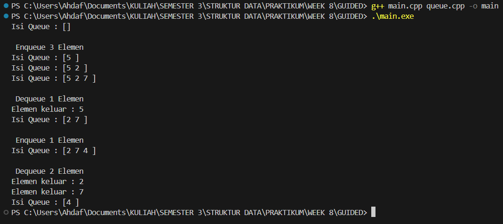
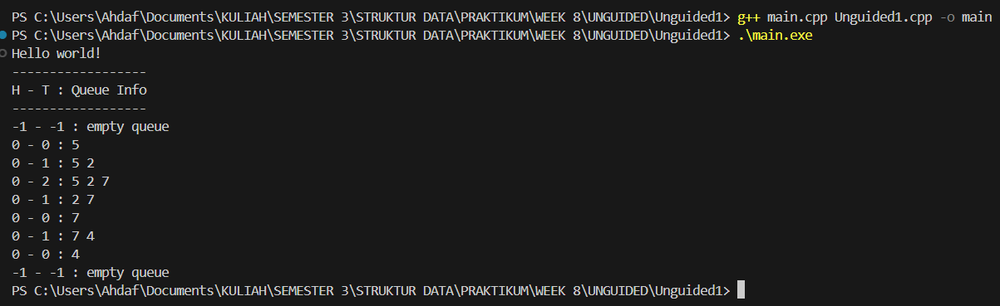
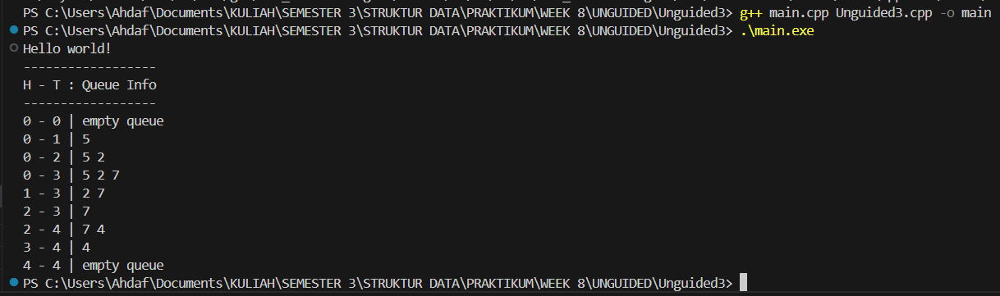

# Praktikum Struktur Data
---
## 1. Nama, NIM, Kelas
---
- **Nama**: Rahmat Ahdaf Albariza
- **NIM**: 103112430003
- **Kelas**: S1IF - 12 - 05 

## 2. Motivasi Belajar Struktur Data
---
Saya termotivasi mempelajari struktur data karena mata kuliah ini membantu saya memahami cara menyimpan dan mengolah data dengan lebih efisien. Pengetahuan ini penting, tidak hanya untuk menyelesaikan tugas kuliah, tetapi juga untuk membangun aplikasi atau sistem yang berguna di dunia nyata.

## 3. Dasar Teori
---
**Struktur data** adalah cara untuk menyimpan, mengatur, dan mengelola data di dalam komputer agar dapat digunakan secara efisien. Struktur data berperan penting dalam pemrosesan informasi dan menjadi dasar dari banyak algoritma. Berikut adalah beberapa teori dasar mengenai struktur data:
- **Array**: Struktur data yang menyimpan elemen dengan tipe data sama dalam urutan tertentu dan diakses menggunakan indeks.
- **Linked List**: Kumpulan simpul (node) yang saling terhubung melalui pointer, di mana setiap simpul berisi data dan alamat simpul berikutnya.
- **Stack**: Struktur data dengan prinsip _Last In First Out (LIFO)_, di mana elemen yang terakhir dimasukkan akan dikeluarkan terlebih dahulu.
- **Queue**: Struktur data dengan prinsip _First In First Out (FIFO)_, di mana elemen yang pertama dimasukkan akan dikeluarkan terlebih dahulu.
- **Graf**: Struktur data yang digunakan untuk menggambarkan hubungan antar objek yang disebut simpul (vertex) dan hubungan antar simpul yang disebut busur (edge).
- **Pohon (Tree)**: Struktur data hierarkis yang terdiri dari simpul dan tepi, dengan satu simpul sebagai akar (root) dan simpul lainnya sebagai anak.

## 4. Guided
---
### 4.1 Guided 1
```cpp
#ifndef QUEUE_H
#define QUEUE_H

#define MAX_QUEUE 5

struct Queue {
    int info [MAX_QUEUE];
    int head;
    int tail;
    int count;
};

void createQueue(Queue &Q);

bool isEmpty(Queue Q);

bool isFull(Queue Q);

void enqueue(Queue &Q, int x);

int dequeue(Queue &Q);

void printInfo(Queue Q);

#endif
```
Penjelasan : 
Program di atas adalah _header file_ untuk membuat sebuah **queue** atau antrian di C++. Queue bekerja dengan prinsip **FIFO (First In First Out)**, yaitu data yang masuk duluan akan keluar duluan. Di dalam struktur `Queue`, ada array `info` yang mampu menampung 5 data, lalu ada juga `head`, `tail`, dan `count` yang dipakai untuk menandai posisi awal antrian, posisi akhir antrian, dan jumlah data yang sedang ada di dalamnya.

Fungsi `createQueue` dipakai untuk menyiapkan antrian sebelum digunakan. Fungsi `isEmpty` mengecek apakah antrian sedang kosong, sementara `isFull` mengecek apakah antrian sudah penuh. Fungsi `enqueue` digunakan untuk menambahkan data baru ke dalam antrian, dan `dequeue` dipakai untuk mengambil data dari antrian sesuai aturan FIFO tadi. Ada juga fungsi `printInfo` yang fungsinya untuk menampilkan data-data yang ada di dalam antrian. Secara keseluruhan, file ini berisi struktur dan deklarasi fungsi dasar untuk mengelola queue sederhana berbasis array.
### 4.2 Guided 2
```cpp
#include "queue.h"
#include <iostream>

using namespace std;


void createQueue(Queue &Q){
    Q.head = 0;
    Q.tail = 0;
    Q.count = 0;
}


bool isEmpty(Queue Q) {
    return Q.count == 0;
}


bool isFull(Queue Q) {
    return Q.count == MAX_QUEUE;
}


void enqueue(Queue &Q, int x) {
    if(!isFull(Q)) {
        Q.info[Q.tail] = x;

        Q.tail = (Q.tail + 1) % MAX_QUEUE;
        Q.count++;
    } else {
        cout << "Antrean Penuh!" << endl;
    }
}


int dequeue(Queue &Q) {
    if(!isEmpty(Q)) {
        int x = Q.info[Q.head];
        Q.head = (Q.head + 1) % MAX_QUEUE;
        Q.count--;
        return x;
    } else {
        cout << "Antrean Kosong!" << endl;
        return -1;
    }
}


void printInfo(Queue Q) {
    cout << "Isi Queue : [";
    if(!isEmpty(Q)) {
        int i = Q.head;
        int n = 0;
        while (n < Q.count) {
            cout << Q.info[i] << " ";
            i = (i + 1) % MAX_QUEUE;
            n++;
        }
    }
    cout << "]" << endl;
}
```
Penjelasan : 
Program di atas berisi fungsi-fungsi untuk menjalankan queue (antrian) sederhana menggunakan array di C++. Fungsi createQueue dipakai untuk mengatur antrian supaya siap dipakai dengan mengatur head, tail, dan count jadi 0. Fungsi isEmpty dan isFull masing-masing mengecek apakah antrian kosong atau sudah penuh. Fungsi enqueue digunakan buat masukin data baru ke antrian. Kalau masih ada tempat, data dimasukkan ke posisi tail, lalu posisi tail digeser menggunakan modulo biar bisa “muter” kembali ke awal array, dan jumlah datanya (count) ditambah. Tapi kalau antrian sudah penuh, program akan menampilkan pesan “Antrean Penuh!”.

Sebaliknya, fungsi dequeue dipakai untuk mengambil data dari bagian depan antrian. Data di posisi head diambil, lalu head digeser ke posisi berikutnya, dan count dikurangi. Kalau ternyata antriannya kosong, akan muncul pesan “Antrean Kosong!”. Terakhir, fungsi printInfo menampilkan semua isi antrian dengan cara membaca data mulai dari head sebanyak count elemen. Secara umum, program ini memakai sistem circular queue supaya pemakaian ruang array lebih efisien.
### 4.3 Guided 3
```cpp
#include <iostream>
#include "queue.h"

using namespace std;


int main(){
    Queue Q;

    createQueue(Q);
    printInfo(Q);

    cout << "\n Enqueue 3 Elemen" << endl;
    enqueue(Q,5);
    printInfo(Q);
    enqueue(Q,2);
    printInfo(Q);
    enqueue(Q,7);
    printInfo(Q);

    cout << "\n Dequeue 1 Elemen" << endl;
    cout << "Elemen keluar : " << dequeue(Q) << endl;
    printInfo(Q);

    cout << "\n Enqueue 1 Elemen" << endl;
    enqueue(Q,4);
    printInfo(Q);

    cout << "\n Dequeue 2 Elemen" << endl;
    cout << "Elemen keluar : " << dequeue(Q) << endl;
    cout << "Elemen keluar : " << dequeue(Q) << endl;
    printInfo(Q);

    return 0;
}
```
Output : 
>

Penjelasan : 
Program di atas adalah bagian `main` yang dipakai untuk mencoba cara kerja **queue** yang sudah dibuat sebelumnya. Pertama, dibuat satu objek `Queue Q`, lalu `createQueue(Q)` dipanggil untuk mengosongkan atau mereset antriannya. Setelah itu, program mulai memasukkan beberapa data ke dalam queue. Pada bagian “Enqueue 3 Elemen”, angka 5, 2, dan 7 dimasukkan satu per satu, dan setiap kali ada elemen baru, `printInfo` dipanggil untuk melihat isi antriannya.

Berikutnya, program melakukan “Dequeue 1 Elemen”, yaitu mengambil satu data dari depan antrian dan menampilkan data yang keluar, lalu mencetak isi queue lagi. Setelah itu, program menambah satu elemen lagi (angka 4) dan menampilkan hasilnya. Terakhir, program melakukan “Dequeue 2 Elemen” untuk mengambil dua elemen berikutnya dan menampilkan kondisi antrian setelahnya. Secara keseluruhan, program ini menunjukkan bagaimana queue bekerja dengan gaya **FIFO**, di mana elemen yang masuk lebih dulu akan keluar lebih dulu.

## 5. Unguided
### Ada perubahan pada file queue.h dan main.cpp
queue.h
```cpp
#ifndef QUEUE_H
#define QUEUE_H

#include <iostream>
using namespace std;

#define MAX_QUEUE 5 
typedef int infotype;

struct Queue {
    infotype info[MAX_QUEUE]; 
    int head;
    int tail;
    int count;
};

void createQueue(Queue &Q);
bool isEmptyQueue(Queue Q);
bool isFullQueue(Queue Q);
void enqueue(Queue &Q, infotype x);
infotype dequeue(Queue &Q);
void printInfo(Queue Q);

#endif
```

main.cpp
```cpp
#include <iostream>
#include "queue.h"
using namespace std;

int main() {
    cout << "Hello world!" << endl; 
    
    Queue Q;
    
    cout << "------------------" << endl;
    cout << "H - T : Queue Info" << endl; 
    cout << "------------------" << endl;

    createQueue(Q); printInfo(Q); 

    enqueue(Q, 5); printInfo(Q);  

    enqueue(Q, 2); printInfo(Q);  

    enqueue(Q, 7); printInfo(Q);  

    dequeue(Q); printInfo(Q); 

    dequeue(Q); printInfo(Q); 

    enqueue(Q, 4); printInfo(Q);  

    dequeue(Q); printInfo(Q); 

    dequeue(Q); printInfo(Q); 

    return 0; 
}
```
### 5.1 Unguided 1
```cpp
#include "queue.h"

void createQueue(Queue &Q) {
    Q.head = -1;
    Q.tail = -1;
}

bool isEmptyQueue(Queue Q) {
    return Q.tail == -1;
}

bool isFullQueue(Queue Q) {
    return Q.tail == MAX_QUEUE - 1;
}

void enqueue(Queue &Q, infotype x) {
    if (isFullQueue(Q)) {
        cout << "Antrean Penuh!" << endl;
    } else {
        if (isEmptyQueue(Q)) {
            Q.head = 0; 
        }
        Q.tail++;
        Q.info[Q.tail] = x;
    }
}

infotype dequeue(Queue &Q) {
    if (isEmptyQueue(Q)) {
        cout << "Antrean Kosong!" << endl;
        return -1;
    } else {
        infotype x = Q.info[Q.head];
        for (int i = Q.head; i < Q.tail; i++) {
            Q.info[i] = Q.info[i + 1];
        }
        Q.tail--;
        if (Q.tail == -1) { 
            Q.head = -1;    
        }
        return x; 
    }
}

void printInfo(Queue Q) {
    cout << Q.head << " - " << Q.tail << " : "; 
    if (isEmptyQueue(Q)) {
        cout << "empty queue" << endl; 
    } else {
        for (int i = Q.head; i <= Q.tail; i++) {
            cout << Q.info[i];
            if (i < Q.tail) {
                cout << " ";
            }
        }
        cout << endl;
    }
}
```
Output : 
>

Penjelasan : 
Waktu pertama kali dibuat lewat `createQueue`, nilai `head` dan `tail` diset ke -1 sebagai tanda kalau antreannya masih kosong. Fungsi `isEmptyQueue` ngecek apakah antrean kosong dengan cara lihat apakah `tail` masih -1, sedangkan `isFullQueue` ngecek apakah antrean sudah penuh, yaitu kalau `tail` sudah mencapai batas maksimum array. Pada proses `enqueue`, program bakal cek dulu apakah antrean penuh. Kalau penuh, tampil pesan "Antrean Penuh!". Kalau belum penuh, dan antrean sebelumnya masih kosong, posisi `head` diset ke 0. Setelah itu `tail` dinaikkan satu dan data baru dimasukin ke posisi itu. Sebaliknya, fungsi `dequeue` dipakai buat ngambil dan ngapus data paling depan. Kalau antrean kosong, bakal muncul pesan "Antrean Kosong!". Tapi kalau ada isinya, nilai pada `head` diambil dulu, lalu semua elemen digeser satu langkah ke depan supaya antrean tetap rapi. Kalau setelah hapus ternyata antrean jadi kosong lagi, `head` ikut diset ulang ke -1. Terakhir, fungsi `printInfo` bakal nampilin posisi `head` dan `tail`, terus nge-print isi antreannya dari depan sampai belakang. Kalau ternyata kosong, dia cuma nulis "empty queue". Intinya, program ini bikin antrean sederhana tanpa model melingkar, jadi setiap kali `dequeue`, elemennya digeser secara manual.

### 5.2 Unguided 2
```cpp
#include "queue.h"

void createQueue(Queue &Q) {
    Q.head = -1;
    Q.tail = -1;
    Q.count = 0;
}

bool isEmptyQueue(Queue Q) {
    return Q.count == 0;
}

bool isFullQueue(Queue Q) {
    return Q.count == MAX_QUEUE;
}

void enqueue(Queue &Q, infotype x) {
    if (isFullQueue(Q)) {
        cout << "Antrean Penuh!" << endl;
    } else {
        if (isEmptyQueue(Q)) {
            Q.head = 0;
            Q.tail = 0;
        } else {
            Q.tail = (Q.tail + 1) % MAX_QUEUE;
        }
        Q.info[Q.tail] = x;
        Q.count++;
    }
}

infotype dequeue(Queue &Q) {
    if (isEmptyQueue(Q)) {
        cout << "Antrean Kosong!" << endl;
        return -1;
    } else {
        infotype x = Q.info[Q.head];
        Q.head = (Q.head + 1) % MAX_QUEUE;
        Q.count--;
        if (Q.count == 0) {
            Q.head = -1;
            Q.tail = -1;
        }
        return x;
    }
}

void printInfo(Queue Q) {
    cout << Q.head << " - " << Q.tail << " : ";
    if (isEmptyQueue(Q)) {
        cout << "empty queue" << endl;
    } else {
        int i = Q.head;
        for (int c = 0; c < Q.count; c++) {
            cout << Q.info[i];
            if (c < Q.count - 1) cout << " ";
            i = (i + 1) % MAX_QUEUE;
        }
        cout << endl;
    }
}

```
Output : 
>

Penjelasan : 
Waktu queue dibuat lewat `createQueue`, nilai `head`, `tail`, dan `count` diset dulu ke kondisi awal supaya antreannya benar-benar kosong. Fungsi `isEmptyQueue` dan `isFullQueue` cuma ngecek apakah jumlah datanya (`count`) itu 0 atau sudah sama dengan kapasitas maksimum. Pada bagian `enqueue`, program ngecek dulu penuh atau nggaknya. Kalau penuh, langsung muncul pesan "Antrean Penuh!". Tapi kalau masih ada ruang, dan antrean masih kosong, `head` dan `tail` diset ke 0. Kalau sudah pernah terisi, `tail` digeser ke index berikutnya pakai `(tail + 1) % MAX_QUEUE`, jadi kalau sudah sampai ujung, dia balik lagi ke index 0. Nilai baru kemudian dimasukin ke posisi `tail` dan `count` dinaikkan. Untuk `dequeue`, data yang paling depan diambil dari posisi `head`, lalu `head` juga digeser ke index berikutnya pakai modulo. Setelah `count` dikurangi, kalau ternyata antrean jadi kosong lagi, `head` dan `tail` direset ke -1. Terakhir, `printInfo` bakal nampilin posisi `head` dan `tail`, lalu nge-print isi antrean satu per satu mulai dari `head`, sambil nge-loop pakai modulo biar tetap bisa muter kalau index-nya lewat batas array. Intinya, circular queue ini lebih efisien karena nggak perlu geser-geser elemen seperti queue biasa.

### 5.3 Unguided 3
```cpp
#include "queue.h"

void createQueue(Queue &Q) {
    Q.head = 0;
    Q.tail = 0;
}

bool isEmptyQueue(Queue Q) {
    return Q.head == Q.tail;
}

bool isFullQueue(Queue Q) {
    return (Q.tail + 1) % MAX_QUEUE == Q.head;
}

void enqueue(Queue &Q, infotype x) {
    if (isFullQueue(Q)) {
        cout << "Antrean Penuh!" << endl;
    } else {
        Q.info[Q.tail] = x;
        Q.tail = (Q.tail + 1) % MAX_QUEUE;
    }
}

infotype dequeue(Queue &Q) {
    if (isEmptyQueue(Q)) {
        cout << "Antrean Kosong!" << endl;
        return -1;
    } else {
        infotype x = Q.info[Q.head];
        Q.head = (Q.head + 1) % MAX_QUEUE; 
        return x;
    }
}

void printInfo(Queue Q) {
    cout << Q.head << " - " << Q.tail << " | "; 
    if (isEmptyQueue(Q)) {
        cout << "empty queue" << endl;
    } else {
        int i = Q.head;
        while (i != Q.tail) {
            cout << Q.info[i] << " ";
            i = (i + 1) % MAX_QUEUE; 
        }
        cout << endl;
    }
}
```
Output : 
>

Penjelasan : 
Saat queue pertama kali dibuat lewat `createQueue`, nilai `head` dan `tail` diset ke 0, yang berarti antreannya masih kosong. Fungsi `isEmptyQueue` ngecek apakah antrean kosong dengan cara lihat apakah `head` sama dengan `tail`, sedangkan `isFullQueue` ngecek apakah antrean sudah penuh pakai rumus `(tail + 1) % MAX_QUEUE == head`. Pas `enqueue` dipanggil, program bakal cek dulu apakah antreannya penuh. Kalau penuh, dia kasih pesan “Antrean Penuh!”. Kalau belum, data baru langsung dimasukin ke posisi `tail`, terus `tail` digeser ke index berikutnya pakai modulo biar bisa balik ke 0 kalau sudah sampai akhir array. Pada `dequeue`, kalau antrean kosong, muncul pesan “Antrean Kosong!”. Tapi kalau masih ada isi, data di posisi `head` diambil, terus `head` juga digeser ke index berikutnya dengan cara yang sama. Fungsi `printInfo` bakal nampilin posisi `head` dan `tail`, lalu nge-loop dari `head` sampai `tail` sambil nge-print semua isi queue, dan loop-nya juga ikut muter kalau perlu. Intinya, circular queue ini bikin proses antrean jadi efisien karena nggak perlu geser-geser data tiap kali ada yang keluar.
## 6. Kesimpulan
Pada praktikum ini, konsep dan implementasi **ADT Queue** dengan tiga mekanisme berbeda berhasil dipahami dan diterapkan, yaitu **Alternatif 1 (head diam, tail bergerak)**, **Alternatif 2 (head bergerak, tail bergerak)**, dan **Alternatif 3 (head dan tail berputar / circular queue)**.  
Setiap alternatif memiliki cara kerja yang berbeda dalam menangani operasi penyisipan (_enqueue_) dan penghapusan (_dequeue_), terutama dalam hal pergerakan indeks dan efisiensi ruang.

Alternatif 1 menggunakan metode penggeseran elemen saat _dequeue_, sehingga kurang efisien.  
Alternatif 2 memperbaiki proses tersebut dengan menggerakkan head tanpa menggeser elemen, namun tetap bisa mengalami kondisi “penuh semu”.  
Alternatif 3 menjadi solusi paling efisien karena memanfaatkan sistem indeks melingkar (circular buffer) sehingga tidak ada pergeseran elemen dan tidak ada kondisi penuh semu.

Dari ketiga implementasi tersebut dapat disimpulkan bahwa pemilihan mekanisme queue sangat berpengaruh terhadap efisiensi program, terutama pada penggunaan memori dan kecepatan operasi. Circular queue (Alternatif 3) merupakan bentuk paling optimal untuk antrian berbasis array.

## 7. Referensi
https://www.w3schools.com/cpp/default.asp

